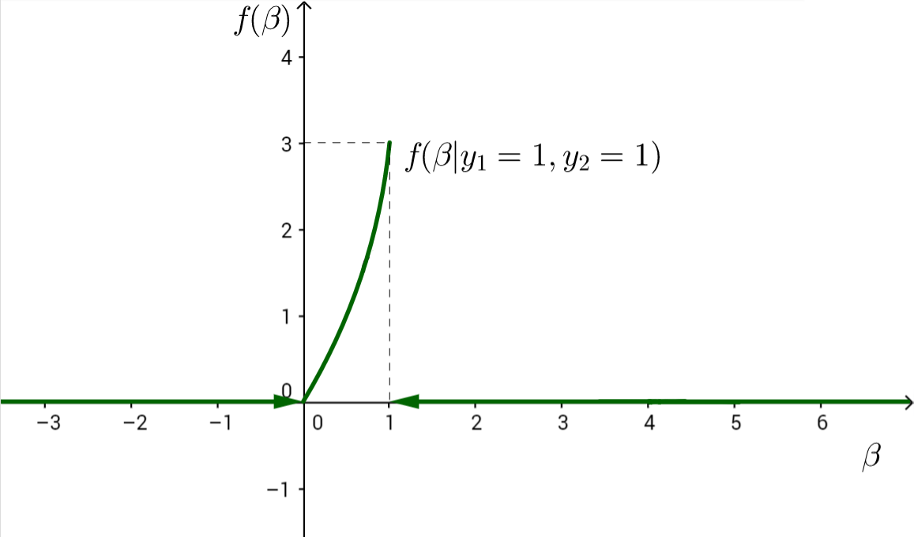

# 16 Байесовский подход
{#16_Bayesian_approach}

конспект: Мария Салунина, Полина Лапшова

дата: 23 января 2017

## 16.1 Хинты к брутальной части (16 января 2017)
### 16.1.1 Первая задача
Дано:

- $\hat{y}=3+7x$

- $R^2=0.6$

- $sVar(y)=1000$

${\it Задание_1}$: найти  $sCov(y, x)$.

Мы знаем, что $sVar(y)=\frac{\sum\limits_{i=1}^n(y_i-\overline{y})^2}{n-1}$.

${\it Замечание}$: чем отличается $Var(y)$ от $sVar(y)$? $Var(y)$ - матрица из констант размера $n \times n$. $sVar(y)$ - вектор размера $1 \times 1$, случайная величина.

Что такое $R^2$?

1) Первая интерпретация: доля объяснённой дисперсии.

    $R^2=\frac{sVar(\hat{y})}{sVar(y)}=0.6$, следовательно, $sVar(\hat{y})=600$.
    
    $\hat{y}=3+7x$, т. е. $\hat{y}$ в семь раз больше $x$, значит:

    $sVar(x)=\frac{600}{49}$
    
2) Вторая интерпретация: $R^2=sCorr^2(y, \hat{y})$

    $sCorr(y, \hat{y})=\sqrt{0.6}$
    
    $sCorr(y, x)=+\sqrt{0.6}$
    
    ${\it Замечание}$: знак $"+"$, так как в регрессии перед $x$ стоит плюс.
    
    $sCorr(y, x)=\frac{sCov(y, x)}{\sqrt{sVar(y)sVar(x)}}=+\sqrt{0.6}$
    
    $sVar(y)=1000$
    
    $sVar(x)=\frac{600}{49}$
    
    Следовательно, $sCov(y, x)=85.7143$
    
${\bf Итог}$: индивидуальные регрессии позволяют найти любую выборочную корреляцию, любую выборочную ковариацию, любую выборочную дисперсию.
    
${\itЗадание_2}$: найти регрессию  $y_i=\beta_1 +\beta_2 x_i +\beta_3 z_i + u_i$

Как найти вектор $\hat{\beta}$?

$\left( \begin{matrix}
\hat{\beta_1}\\ 
\hat{\beta_2}\\ 
\hat{\beta_3}\\
\end{matrix} \right) = (X^{'}X)^{-1}X^{'}y$

Фриша-Вау: проведём регрессию в два шага.

1) Отрегрессируем $x$, $z$, $y$ на $1$ (чтобы избавиться от единичного столбца)
    
    Для $x$:

    $x_i=c+u_i$
    
    тогда: $\hat{c}=\overline{x}$,
    
    $\widetilde{x_i}=x_i-\overline{x}$ - остаток от регрессии $x$.
    
    $\dots$
    
    Получим остатки от регрессий $\widetilde{x}, \widetilde{z}, \widetilde{y}$.

2) Чтобы оценить $\hat{\beta_2}$ и $\hat{\beta_3}$, необходимо построить следующую регрессию.

    $\widetilde{y}$ на $\widetilde{x}$, $\widetilde{z}$
    
    $\hat{\widetilde{y_i}}=\hat{\beta_2} \widetilde{x_i} + \hat{\beta_3} \widetilde{z_i}$
    
    Следовательно:
    
    $\left( \begin{matrix}
    \hat{\beta_2}\\ 
    \hat{\beta_3}\\ 
    \end{matrix} \right) = (\widetilde{X}^{'}\widetilde{X})^{-1}\widetilde{X}^{'}\widetilde{y}$
    
    $\widetilde{y} = \left( \begin{matrix}
    y_1 - \overline{y}\\ 
    \vdots\\
    y_n - \overline{y}\\ 
    \end{matrix} \right)$
    
    $\widetilde{X} = \left( \begin{matrix}
    x_1 - \overline{x} & z_1 - \overline{z}\\ 
    \vdots& \vdots\\
    x_n - \overline{x} & z_n - \overline{z}\\ 
    \end{matrix} \right)$
    
    $\widetilde{X}^{'}\widetilde{X} = \left( \begin{matrix}
    \sum\limits_{i=1}^n(x_i-\overline{x})^2 & \sum\limits_{i=1}^n(x_i-\overline{x})(z_i-\overline{z})\\ 
    \sum\limits_{i=1}^n(x_i-\overline{x})(z_i-\overline{z}) & \sum\limits_{i=1}^n(z_i-\overline{z})^2\\ 
    \end{matrix} \right)$
    
    $\widetilde{X}^{'}\widetilde{y} = \left( \begin{matrix}
    \sum\limits_{i=1}^n(x_i-\overline{x})(y_i-\overline{y})\\ 
    \sum\limits_{i=1}^n(z_i-\overline{z})(y_i-\overline{y})\\ 
    \end{matrix} \right)$
    
    $\left( \begin{matrix}
    \hat{\beta_2}\\ 
    \hat{\beta_3}\\ 
    \end{matrix} \right) = \left(\frac{\widetilde{X}^{'}\widetilde{X}}{n-1}\right)^{-1}\frac{\widetilde{X}^{'}\widetilde{y}}{n-1}$
    
    Средние были даны, любая регрессия проходит через среднюю линию, можно восстановить $\hat{\beta_1}$.

### 16.1.2 Третья задача

Дано две модели:

$\hat{y_i}=\hat{\beta_1}+\underset{(3.2)}{\hat{\beta_2}}x_i$

$\hat{y_i}=\hat{\gamma_1}+\hat{\gamma_2} x_i+\underset{(7.8)}{10}z_i$

$R^2=0.8$ (для второй модели)

${\itЗадание}$: проверить гипотезу $H_0: \beta_2=0$.

Проверим сначала $\gamma_3$:

$t = \frac{10}{7.8}$

Если знаем $R^2$, то можем проверить значимость регрессии в целом.

$t^2=F=\left(\frac{10}{7.8}\right)^2$

Одинаковы ли регрессии.

$F = \frac{(R_{UR}^2-R_R^2)/1}{R_{UR}^2/(n-k_{UR})}$

Пояснение: единичка в знаменателе числителя — одно ограничение на вторую регрессию ($\gamma_3=0$).

Следовательно, получаем $R_R^2$, можем проверить гипотезу о значимости.

Почему $t^2=F$?

$y_i=\beta_1+\beta_2 x_i+u_i$

$t = \frac{\hat{\beta_2}}{se(\hat{\beta_2})} = \frac{sCov(x,y)}{sVar(x)}\frac{1}{\sqrt{\frac{RSS}{n-2}\frac{1}{\sum(x_i-\overline{x})^2}}}$

$RSS^2 = (1-R^2)*TSS = (1-sCorr^2(x,y))sVar(y)(n-1)$

$t^2=\frac{sCov^2(x,y)}{sVar(x)}\frac{(n-2)(n-1)}{(1-sCorr^2(x,y))sVar(y)(n-1)}=\frac{sCorr^2(x,y)/1}{(1-sCorr^2(x,y))/(n-2)}$

$H_0: \beta_2=0$ — одно ограничение. Проверяем одну и ту же гипотезу только с разных сторон.

$F=\frac{R^2}{(1-R^2)/(n-2)}$ — вуаля! то же самое! Ч.Т.Д.

## 16.2 Отличие классического подхода от байесовского
### 16.2.1 Классический подход
$\beta$ vs $\hat{\beta}$

1) $\beta$ — неизвестный параметр $const$ (не знаю и никогда не узнаю). $P(\beta>0)$ — бессмысленный вопрос (данная вероятность равна либо $0$, либо $1$). 

2) Модель: как данные $y_i$ зависят от $\beta$.

3) Применяется метод (метод наименьших квадратов, метод моментов, метод максимального правдоподобия и т.д.); на основании модели получаем $\hat{\beta}=f(y_1, y_2, \dots, y_n)$.

4) ЦПТ, ЗБЧ, $\Delta$-метод при $n \to \infty$
    
    $\hat{\beta} \sim \mathbb{N}(., .)$.
    
${\bf Итог}$: пункт 3 — точечная оценка $\hat{\beta}$; пункт 4 — доверительный интервал $\beta \in [\hat{\beta} - \dots; \hat{\beta} + \dots]$.

### 16.2.2 Байесовский подход
Есть только $\beta$ — всё наше знание о неизвестном параметре сформулировано в виде закона распределения.

1) Априорное мнение о $\beta$ до получения наблюдения. Существует $P(\beta>0)$.

2) Модель: как данные $y_i$ зависят от $\beta$.

3) Используется формула условной вероятности. По формуле $f(\beta|y_1, y_2, \dots, y_n)$ получается апостериорное распределение $\beta$.

    $P(\beta>0|y_1, y_2, \dots, y_n)$ — можно найти.

4) Можно получить точечную и интервальную оценку.

### 16.2.3 Упражнение №1 (про шапку с монетками)
${\it Условие}$: в шапке есть серебряные и золотые монетки; $\beta$ — доля золотых монеток.

1)  $0 \leqslant \beta \leqslant 1$

    Предположим, $\beta$ распределена равномерно: $\beta \sim \mathbb{U}[0, 1]$
    
2) $y_i$ — наблюдения.

    \[
    y_i =
    \begin{cases}
    0, & \text{если монетка серебряная;} \\
    1, & \text{если монетка золотая.}
    \end{cases}
    \]
    
    Достаём, смотрим, какая монетка, отмечаем наблюдение, кидаем монетку обратно в шапку, перемешиваем.
    
    $y_i|\beta$ — независимы
    
    $\\$
    
    |$y_i|\beta$|0|1|
    |-----------|---------|---------|
    |${\it вероятность}$|$1-\beta$| $\beta$ |
    
    
    $\\$
    
    $\\$
     
    
    
    $\\$
    
    $y_1=1$
    
    $y_2=1$
    
    $f(\beta|y_1=1, y_2=1)=\frac{\beta, y_1=1, y_2=1}{P(y_1=1,y_2=1)} \propto f(\beta, y_1=1, y_2=1) = P(y_1=1, y_2=1|\beta)f(\beta)$
    
    \[
    P(y_1=1, y_2=1|\beta)f(\beta) =
    \begin{cases}
    \beta^2, & \beta \in [0;1], \\
    0, & \text{иначе.}
    \end{cases}
    \]
    
    $\int\limits_0^1 \beta^2\,d\beta = \left. \frac{\beta^3}{3}\right|_0^1 = \frac{1}{3}$
    
    Следовательно, необходимо домножить на 3.
    
    \[
    f(\beta|y_1=1, y_2=1) =
    \begin{cases}
    3\beta^2, & \beta \in [0;1], \\
    0, & \text{иначе.}
    \end{cases}
    \]
    
    $\\$
     
    
    
    $\\$
    
    До наблюдений: $P(\beta>\frac{1}{2})=\frac{1}{2}$.
    
    После наблюдений: $P(\beta>\frac{1}{2}|y_1=1, y_2=1)=\int\limits_\frac{1}{2}^1 3\beta^2\,d\beta = \frac{7}{8}$.
    
    Точечная оценка: апостериорное мат. ожидание или медиана.
    
    $\mathbb{E}(\beta|y_1=1, y_2=1) = \int\limits_0^1 \beta*f(\beta|y_1=1, y_2=1)\,d\beta$

### 16.2.4 Упражнение №2 (про Машу и мышек)
${\it Задача}$: где-то на числовой прямой, в точке $m$, Маша прячет от мышек сыр. При этом известно, что её любимое число — 13.

1) $m \sim \mathbb{N}(13, 100)$

2) Прибежали две мышки и пропищали, где, по их мнению, наиболее сильно пахнет сыром: $y_1=9$, $y_2=18$.

    * $y_i|m$ — независимы;
    * $y_i=m+u_i$;
    * $y_i|m \sim \mathbb{N}(m, 25)$.
    
     $\\$
    
3) $f(m)\propto e^{-(m-13)^2/(2*100)}$ — априорная функция плотности.

$f(m|y_1=9,y_2=18) \propto f(m,y_1=9,y_2=18)=f(y_1=9,y_2=18|m)f(m) \propto e^{-(9-m)^2/(2*25)}e^{-(18-m)^2/(2*25)}e^{-(m-13)^2/(2*100)} \propto e^{-\frac{1}{2} * \frac{1}{100} * (9m^2-2m(13+9*4+18*4))} \propto e^{-\frac{1}{2} * \frac{1}{100/9} * (m-\frac{121}{9})^2}$ —  функция плотности.

$\\$

$m \sim \mathbb{N}(\frac{121}{9}, \frac{100}{9})$

$\\$

${\it Магия}$: $\frac{121}{9}=\frac{4}{9}*9+\frac{4}{9}*18+\frac{4}{9}*13$

$\\$

#### Домашнее задание
Установить STAN bayesian.