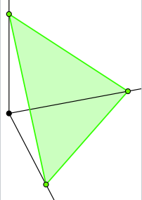

---
output:
  html_document: default
  word_document: default
---


# Мультиномиальное распределение {#multinomial}

__Конспект: Молдованов Александр, Умрихин Александр__

__Дата: 08.02.2017__

Можно почитать о мультиномиальном распределении на [википедии](https://en.wikipedia.org/wiki/Multinomial_distribution)

## Задание 1

__Дано:__
Вы решили сходить в лес 100 раз. Вероятность встретить там волка составляет 0,3, Бабу-Ягу - 0,1, а Хариса - 0,6.

Пусть
\[
\begin{pmatrix}
х_{1} \\
х_{2} \\
х_{3}
\end{pmatrix} ,
\]
где  $х_{1}$ - количество раз, когда вы встретили волка,
       $х_{2}$ - Бабу-Ягу,
       $х_{3}$ - Хариса.

Этот вектор имеет мультиномиальное распределение с параметрами (n=100, p(0,3; 0,1; 0,6)), т. е.
\[
\begin{pmatrix}
х_{1} \\
х_{2} \\
х_{3}
\end{pmatrix} \sim multi (n=100, p(0,3; 0,1; 0,6))
\]
__Вопрос:__ Какова вероятность встретить волка 10 раз, Бабу-Ягу - 20, а Хариса - 70? p($х_{1}$=10, $х_{2}$=20, $х_{3}$=70)-?

__Решение:__
\[
\left.
\begin{array}
[c]{ll}%
0,3^{10} - \text{вероятность встретить 10 волков}\\
0,1^{20} - \text{вероятность встретить 20 раз Бабу-Ягу}\\
0,6^{70} - \text{вероятность встретить 70 раз заблудившегося Хариса}
\end{array}
\right\} =>
\]
вероятность встретить их всех за 100 раз = $0,3^{10}\times0,1^{20}\times0,6^{70}$

Важен коэффициент перед этим всем: !!!!!! обосновать !!!!!

$C^{10}_{100} \times C^{20}_{90}$ = 
$\frac{100!}{10!\times90!} \times \frac{90!}{20!\times70!} = \frac{100!}{10!\times20!\times70!}$\\

__Ответ:__    $\frac{100!}{10!\times20!\times70!}\times0,3^{10}\times0,1^{20}\times0,6^{70}$

## Задание 2

__Дано:__
\[
p =
\begin{pmatrix}
p_{1} \\
p_{2} \\
p_{3}
\end{pmatrix} ,
\]
\[
x =
\begin{pmatrix}
x_{1} \\
x_{2} \\
x_{3}
\end{pmatrix} \sim mult(n, (p_{1}, p_{2}, p_{3}))
\]

__Вопрос:__ $E(X), Var(X)$ - ?

__Решение:__
\[
E(X)=\begin{pmatrix}
np_{1} \\
np_{2} \\
np_{3}
\end{pmatrix}
\]
\begin{multline}
Cov(x_{1}; x_{2}) = Cov(I_{1,1} + I_{1,2} + ... + I_{1,100}; I_{2,1} + I_{2,2} + ... + I_{2, 100})=\\
= \sum\ Cov(I_{1,i}; I_{2,i}) = nCov(I_{1,1};I_{2,1})=n(E(I_{1,1}I_{2,1})-E(I_{1,1})E(I_{2,1}))=-np_{1}p_{2} \Rightarrow\\
Var(X)=\begin{pmatrix}
np_{1}(1 - p_{1}) & -np_{1}p_{2} & -np_{1}p_{3} \\
-np_{1}p_{2} & np_{2}(1 - p_{2}) & -np_{2}p_{3}\\
-np_{1}p_{3} & -np_{2}p_{3} & np_{2}(1 - p_{2})
\end{pmatrix} = 
n\Bigg(\begin{pmatrix}
p_{1} & 0 & 0 \\
0 & p_{2} & 0\\
0 & 0 & p_{3}
\end{pmatrix}-pp^{T}\Bigg)
\end{multline}


## Определение симплекса (n-мерного)

Опять же можно почитать на [википедии](https://en.wikipedia.org/wiki/Simplex#The_standard_simplex)

$\Delta^n = \{x | x_1 , ..., x_n \geq 0 , x_1 + ... + x_n =1 \}$





## Переходим в STAN

Для Байевского подхода нужна модель, которая описывает данные:

\[
\begin{pmatrix}
х_{1} \\
х_{2} \\
х_{3}
\end{pmatrix} \sim multi (n=100, p(0,3; 0,1; 0,6))\]

Давайте уточним вводные данные:

Мы были в гостях у бабушки. Она нам сказала, что волки водятся в лесу также часто, как и Баб-Яжки.

Следовательно у вероятность встретить волка равна $\alpha$, Бабу-Ягу тоже $\alpha$, а Хариса: $1-2\alpha$


Зададим априорное распределение на $\alpha$:

$\alpha\sim U[0,0.5]$, где $U$ - равномерное распределение

Следовательно, наша задача сводится к тому, чтобы получить апостериорное распределение $\alpha$: f($\alpha$(x))


```{r 1, results='hide',message=FALSE}
library(rstan)
library(bayesplot)

data <- list(y = c(15, 5, 80))

model <- stan_model(file = 'multinomial.stan')

fit <- sampling(model, data = data, seed = 42)

fit

fit_array <- as.array(fit)
mcmc_hist(fit_array)

mcmc_trace(fit_array, pars = 'a')
mcmc_violin(fit_array, pars = 'a')
mcmc_hist(fit_array, pars = 'y_new[3]')

fit_array[ , 2, 1]
```

