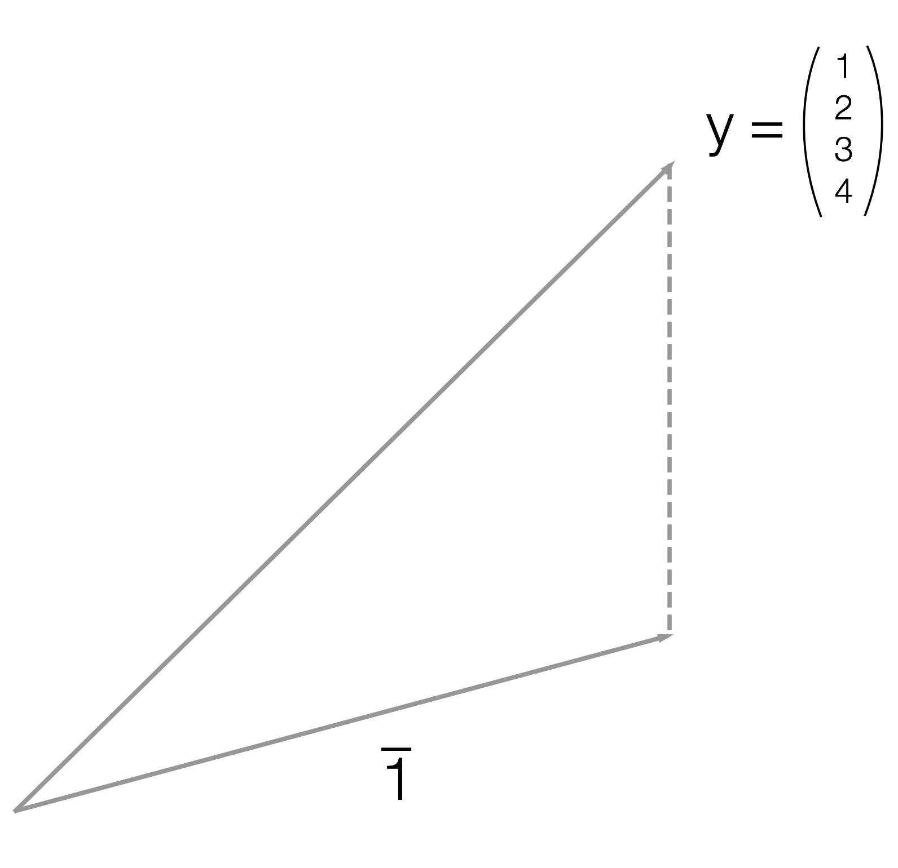

# О конспекте {-}

Метрика с R :)

Напутствия:

1. Идеальный конспект — интересный и без отклонений от здравомыслия. Примочки и пеночки нужны! Не будь занудой!

1. Конспект одного семинара должен иметь одно заглавие уровня `#` и несколько, скажем от двух до пяти, подзаголовков уровня `##`. После «решёточек» должен идти пробел. После заголовка должен стоять краткий английский уникальный идентификатор, например, `{#04_matrix_algebra}`.

1. Помни об оформлении знаков препинания: после запятой есть пробел, а до запятой — нет. Существует длинное тире, `—`, которое отличается от просто дефиса `-`.

1. Рисунки оформляй в открытом софте ([tex + tikz](http://www.computational-logic.org/content/study/master/documents/softskills_tikz.pdf), [inkscape](https://inkscape.org/en/), [graphviz](https://inkscape.org/en/), [geogebra](https://www.geogebra.org/), [draw.io](https://www.draw.io/) и прочее) и прикладывай к работе.

1. Рисунки клади в подпапку `images`

1. Соблюдай конвенцию о названиях файлов: файлы относящиеся к третьему семинару должны начинаться с `03_`, и сам конспект и рисунки. Имена файлов не должны содержать русских букв и пробелов.

1. Никаких `здесь` и `тут` в ссылках. Текст, замещающий ссылку, должен быть осмысленным! Например, `[Весёлый поисковик](http://www.yandex.ru)`

1. Про язык разметки [маркдаун](https://guides.github.com/features/mastering-markdown/). Подробно рассказано как вставлять картинки, списки, цитаты, оформлять разделы и подразделы.

1. Про язык [латех от Воронцова](http://www.ccas.ru/voron/download/voron05latex.pdf). Подробно рассказано, как набирать дроби, суммы и другие формулы. Частые косяки:

    - Функции оформляются со слэшем спереди, например, `\ln`, `\cos`
    - Забудь про `$$`! Формулы на всю строчку пишутся в окружении `\[...\]`, а именно в три строки:
```latex
\[
a^2 + b^2 = c^2
\]
```
    - Русский текст внутри формул пишется с помощью `\text{Привет!}`. 
1. Посмотри, [как сделали конспект другие](https://github.com/bdemeshev/em301/tree/master/2016/stud_notes), и сделай лучше! :) Обрати внимание на название .Rmd файлов, на структуру внутри .Rmd файлов.

1. Каждый кусок кода должен иметь уникальное название, например, `{r, "plotting_histogram"}`

1. Уважай букву `ё` – ставь над ней точки! :)


\newcommand{\rank}{\mathrm{rank}}


```{r, "knitr options", echo = FALSE}
library("knitr")
library("tikzDevice")

activateTikz <- function() {

  # tikz plots options
  options(tikzDefaultEngine = "xetex")

  # cash font metrics for speed:
  # options(tikzMetricsDictionary = "./tikz_metrics")

  add_xelatex <- c("\\defaultfontfeatures{Ligatures=TeX, Scale=MatchLowercase}",
                   "\\setmainfont{Linux Libertine O}",
                   "\\setmonofont{Linux Libertine O}",
                   "\\setsansfont{Linux Libertine O}",
        "\\newfontfamily{\\cyrillicfonttt}{Linux Libertine O}",
        "\\newfontfamily{\\cyrillicfont}{Linux Libertine O}",
        "\\newfontfamily{\\cyrillicfontsf}{Linux Libertine O}")

  options(tikzXelatexPackages = c(getOption("tikzXelatexPackages"),
                                  add_xelatex))

  # does remove warnings:
  # it is important to remove fontenc package wich is loaded by default
  options(tikzUnicodeMetricPackages = c("\\usetikzlibrary{calc}",
                                        "\\usepackage{fontspec, xunicode}", add_xelatex))


  opts_chunk$set(dev = "tikz", dev.args = list(pointsize = 11))
}


colFmt <- function(x, color) {
  outputFormat <- opts_knit$get("rmarkdown.pandoc.to")
  if (outputFormat == "latex") {
    result <- paste0("\\textcolor{", color, "}{", x, "}")
  } else if (outputFormat %in% c("html", "epub")) {
    result <- paste0("<font color='", color, "'>", x, "</font>")
  } else {
    result <- x
  }
  return(result)
}

outputFormat <- opts_knit$get("rmarkdown.pandoc.to")


if (outputFormat == "latex") {
  activateTikz()
  # другую тему для ggplot2 выставить?
}

```

Данная версия конспекта скомпилирована для `r outputFormat`.


```{r, warning=FALSE, message=FALSE}
library("tidyverse") # ggplot2 for plots, dplyr for data manipulation, broom and more
library("sandwich") # оценка Var для гетероскедастичности
library("lmtest") # тест Бройша-Пагана
library("data.table") # манипуляции с данными
library("reshape2") # преобразование длинных таблиц в широкие
```

<!--chapter:end:index.Rmd-->

# Метод наименьших квадратов {#ols_intro}

Конспект: Бердникович Алеся, Головина Мария

дата: 05.09.2016


## Основная задача
Маша каждый день ловит покемонов и решает задачи по теории вероятностей. Пусть x и y - случайные величины, $x_i$ - количество решённых в i-тый день задач, а $y_i$ - количество пойманных в i-тый день покемонов. Результаты наблюдения за действиями Маши представлены в таблице:

День|$x_i$|$y_i$
----|-----|-----
1   |1    |10
2   |2    |0
3   |0    |4

Необходимо определить, как количество пойманных за день покемонов зависит от количества решённых за день задач. Предположим, что регрессионная модель имеет линейный вид
$y_i = \beta_1+\beta_2 x_i + \epsilon_i$,
где коэффициенты $\beta_1, \beta_2$ неизвестны и должны быть оценены, а $\epsilon_i$ - случайная величина. Тогда прогнозируемая зависимость имеет вид $\hat{y}_i=\hat{\beta}_1+\hat{\beta}_2x_i$.

### Метод наименьших квадратов (OLS):


$y_i-\hat{y}_i$ - ошибка прогноза, которую нужно минимизировать. Штрафная функция:

\[
Q(\hat{\beta}_1,\hat{\beta}_2) = (y_1-\hat{y}_1)^2 + (y_2-\hat{y}_2)^2 + (y_3-\hat{y}_3)^2 = (y_1-(\hat{\beta}_1+\hat{\beta}_2 x_1))^2 + (y_2-(\hat{\beta}_1+\hat{\beta}_2x_2))^2 + (y_3-(\hat{\beta}_1+\hat{\beta}_2x_3))^2 \to min_{\hat{\beta}_1,\hat{\beta}_2}
\]

### Метод наименьших модулей (LAD):


Альтернативный метод минимизации ошибок прогноза. Отличие заключается в виде штрафной функции: $$Q(\hat{\beta}_1,\hat{\beta}_2) = |y_1-\hat{y_1}|^2 + |y_2-\hat{y}_2|^2 + |y_3-\hat{y}_3|^2 \to min_{\hat{\beta}_1,\hat{\beta}_2}$$


Найдём $\hat{\beta}_1,\hat{\beta}_2$ в нашей задаче методом наименьших квадратов:
$$Q(\hat{\beta}_1,\hat{\beta}_2) = (y_1-(\hat{\beta}_1+\hat{\beta}_2x_1)^2 + (y_2-(\hat{\beta}_1+\hat{\beta}_2x_2))^2 + (y_3-(\hat{\beta}_1+\hat{\beta}_2x_3))^2$$
$$Q(\hat{\beta}_1,\hat{\beta}_2) = (10-(\hat{\beta}_1+\hat{\beta}_2)^2 + (0-(\hat{\beta}_1+2\hat{\beta}_2))^2 + (4-(\hat{\beta}_1))^2 \to min$$
$$\frac{\partial Q}{\partial \hat{\beta}_1} = -28 + 6\hat{\beta}_1 + 6\hat{\beta}_2 = 0$$
$$\frac{\partial Q}{\partial \hat{\beta}_2} = -20 + 6\hat{\beta}_1 + 10\hat{\beta}_2 = 0$$
$$\hat{\beta}_1 = \frac{20}{3}, \hat{\beta}_2 = -2$$

Искомая оценка зависимости числа пойманных покемонов от числа решённых задач:
$$\hat{y}_i = \frac{20}{3} - 2x_i$$
\newpage

## Реализация в R:


```{r, "data"}
x <- c(1, 2, 0)
y <- c(10, 0, 4)
md <- data.frame(problem = x, pokemon = y)
md
```


Восстановление линейной зависимости методом наименьших квадратов:
```{r, "ols"}
model_1_ols <- lm(data = md, pokemon~problem)
summary(model_1_ols)
```


Подключаем нужный пакет:
```{r, "quantreg", message=FALSE}
library("quantreg")
```

Если пакета не установлен, то это исправляется командой
```{r, "install", eval=FALSE}
install.packages("quantreg")
```


Восстановление линейной зависимости методом наименьших модулей:
```{r, "lad"}
model_1_lad <- rq(data = md, pokemon~problem)
summary(model_1_lad)
```

Предположим теперь иную модель зависимости $y_i = \hat{\beta}x_i$, ищем оценку единственного неизвестного коэффициента $\hat{\beta}$ с помощью метода наименьших модулей. Штрафная функция примет вид
$$Q(\hat{\beta}) = |10-\hat{\beta}| + |0-\hat{\beta}| + |4-0| \to min$$
Точки изломов функции находятся в нулях подмодульных выражений: $\hat{\beta}=0$ и $\hat{\beta}=10$. Функция принимает наименьшее значение при $\hat{\beta}=0$ (см. график), что говорит об отсутствии зависимости числа пойманных покемонов от числа решённых задач.

### График штрафной функции:


```{r, "lad_function"}
x <- seq(-10, 20, 0.001)
fx <- (x <= 0) * (14 - 3 * x) +
      (x > 0 & x < 10) * (14 + x) +
      (x >= 10) * (3*x - 6)
plot(x = x, y = fx, xlab = expression(hat(beta)), ylab = 'Q', pch = 20, col = 'orchid4')
```

## Домашнее задание

Вывести общие формулы для коэффициентов $\hat{\beta}, \hat{\beta}_1, \hat{\beta}_2$, используя МНК-оценку, при условии, что:

1. $y_i = \beta x_i + \epsilon_i, \  \hat{y}_i = \hat{\beta} x_i$;
2. $y_i = \hat{\beta}_1 + \hat{\beta}_2 x_i + \epsilon_i, \  \hat{y}_i = \hat{\beta}_1+\hat{\beta}_2 x_i + \epsilon_i$.

<!--chapter:end:01_seminar.Rmd-->

\newcommand{\E}{\mathbb{E}}
\newcommand{\tr}{\mathrm{tr}}
\newcommand{\Var}{\mathbb{V}ar}
\newcommand{\Cov}{\mathbb{C}ov}

# Вспомнить всё {#recall_all}


1. Найдите длины векторов $a=(1,1,1)$ и $b=(1,2,3)$ и косинус угла между ними. Найдите один любой вектор, перпенидкулярный вектору $b$.

1. Сформулируйте теорему о трёх перпендикулярах и обратную к ней

1. На плоскости $\alpha$ лежит прямая $\ell$. Вне плоскости $\alpha$ лежит точка $C$. Ромео проецирует точку $C$ на прямую $\ell$ и получает точку $R$. Джульетта проецирует точку $C$ сначала на плоскость $\alpha$, а затем проецирует полученную точку $A$ на прямую $\ell$. После двух действий Джульетта получает точку $D$. Обязательно ли $R$ и $D$ совпадают?

1. Для матрицы
\[
A=\begin{pmatrix}
5 & 4 \\
4 & 5 \\
\end{pmatrix}
\]

    + Найдите собственные числа и собственные векторы матрицы
    + Найдите $\det (A)$, $\tr(A)$
    + Найдите собственные числа матрицы $A^{2016}$, $\det (A^{2016})$ и $\tr(A^{2016})$

1. Известно, что $X$ --- матрица размера $n \times k$ и $n>k$, известно, что $X'X$ обратима. Рассмотрим матрицу $H=X(X'X)^{-1}X'$. Укажите размер матрицы $H$, найдите $H^{2016}$, $\tr(H)$, $\det(H)$, собственные числа матрицы $H$. Штрих означает транспонирование.

1. Занудная халява: известно, что $\Cov(X, Y)=5$, $\Var(X)=10$, $\Var(Y)=20$, $\E(X)=10$, $\E(Y)=-10$. Найдите $\Cov(X+2Y, Y-X)$, $\Var(X+2Y)$, $\E(X+2Y)$.

1. За 100 дней Ромео посчитал все глубокие вздохи Джульетты. Настроение Джульетты столь спонтанно, что глубокие вздохи за разные дни можно считать независимыми. В сумме оказалось 890 вздохов. Сумма квадратов оказалась равна 8000. Постройте 95%-ый доверительный интервал для математического ожидания ежедневного количества глубоких вздохов Джульетты. На~уровне значимости 5%-ов проверьте гипотезу, что математическое ожидание равно~9.

1. Ромео подкидывает монетку два раза. Если монетка выпадает орлом, то Ромео кладет в мешок черный шар, если решкой — белый. Джульетта не знает, как выпадала монетка, и достает шары из мешка наугад по очереди. Первый шар оказался черного цвета. Какова вероятность того, что второй шар Джульетты будет белым?


***


Что-то с памятью моей стало...

Линейная алгебра:

1. Великолепный учебник! Strang, Introduction to linear algebra. Ознакомиться можно на [gen.lib.rus.ec](http://gen.lib.rus.ec/) :)

 

<!--chapter:end:02_seminar.Rmd-->

# Геометрия МНК {#ols_geometry}

конспект: Света Колесниченко

дата: 19 сентября 2016

## Обозначения {#notation}

**Варианты представления регрессии:**

- Скалярный вариант: $\hat y_{i} = \hat \beta_1 + \hat \beta_2\, x_{i} + \hat \beta_3\, z_{i}$

- Векторный вариант: $\hat y = \hat \beta_1\, e + \hat \beta_2\, x + \hat \beta_3\, z$

\[
\begin{matrix} & e = \vec 1 = \\ \end{matrix}
\begin{pmatrix} 1 \\ \vdots \\ 1 \end{pmatrix}
\begin{matrix} \textit{ - единичный вектор размерности $n \times 1$}, \end{matrix}
\]

\[
\begin{matrix} & x = \\ \end{matrix}
\begin{pmatrix} x_{1} \\ \vdots \\ x_{n} \end{pmatrix}
\begin{matrix} & y  = \\ \end{matrix}
\begin{pmatrix} y_{1}  \\ \vdots  \\ y_{n} \end{pmatrix}
\begin{matrix} & z = \\ \end{matrix}
\begin{pmatrix} z_{1}  \\ \vdots \\ z_{n} \end{pmatrix}
\textit{ - векторы переменных}
\]
\

Количество наблюдений = $n$, количество коэффициентов $\beta$ = количество регрессоров = $k$.

- Матричный вариант: $\hat y = X\, \hat \beta$

\[
\begin{matrix} & \hat \beta = \\ \end{matrix}
\begin{pmatrix} \hat \beta_{1} \\ \vdots \\ \hat \beta_{k} \end{pmatrix}
\begin{matrix} \textit{ - вектор размера } k\times 1, \end{matrix}
\]

\[
\begin{matrix} & X = \\ \end{matrix}
\begin{pmatrix}
1 & x_{1} & z_{1} \\
\vdots & \vdots & \vdots \\
1 & x_n & z_{n}
\end{pmatrix}
\begin{matrix} \textit{ - матрица размера } n \times k \end{matrix}
\]
\

**Конвенция об обозначениях:**

1. $y, \beta, \hat \beta, x, z$  - векторы

1. $y_{i}, \beta_{j}, \hat \beta_{7}, x_{45}, z_{37}$ - числа (скаляры)

1. $\Omega, X, H$  - матрицы

## Ныряем в $n$-мерное пространство {#deep_in_rn}

\[
\min_{i\in I} \sum_{i=1}^n (y_{i} - \hat y_{i})^{2} =
\min_{i\in I} \sum_{i=1}^n |y_{i} - \hat y_{i}|^{2} \textit{ - минимизируем квадрат длины вектора}
\]

\[
\begin{pmatrix} \bar y \\ \vdots \\ \bar y \end{pmatrix}
\begin{matrix} & = \bar y \cdot \\ \end{matrix}
\begin{pmatrix} 1 \\ \vdots \\ 1 \end{pmatrix}
\begin{matrix} & = \bar y \cdot \vec 1 \end{matrix}
\]

$\bar y = \hat y$ - т.к. $\bar y \cdot \vec 1 = \hat y \cdot \vec 1$

среднее значение = среднее значение прогнозов ($\hat y_{i}$)


"Лапа" = $Lin (e, x, z) \leftarrow$ выбираем через e, x, z положение $\hat y$

$\hat y$ - проекция y на "лапу"

y - линейная комбинация e, x, z $\rightarrow$ лежит в линейной оболочке этих векторов

$\hat \varepsilon = y - \hat y$ - вектор "остатков"/ошибок прогнозов/resideals

$\hat \varepsilon \,\bot\,  e, \hat \varepsilon \,\bot\, x, \hat \varepsilon \,\bot\, y$

$\hat \varepsilon \cdot \vec 1 = 0$, $\hat \varepsilon \cdot x = 0$, $\hat \varepsilon \cdot z = 0$ $\leftarrow$ скалярное произведение векторов (ссыль подробнее) перпендикулярных векторов равно 0.

$\hat \varepsilon  \, \bot \,  \textit{Лапа} \rightarrow \hat \varepsilon  \, \bot \,  \textit{любому вектору, лежащему в Лапе}$

> [Великая Теорема о 3 перпендикулярах](https://ru.wikipedia.org/wiki/Теорема_о_трёх_перпендикулярах) и аж в 2 формулировках и с чертёжиком.

\[
\sum_{i=1}^n \hat \varepsilon_{i}=0 ,
\sum_{i=1}^n \hat \varepsilon_{i} x_{i}=0
\]
\[
\begin{matrix} & X' = \\ \end{matrix}
\begin{pmatrix}
1 & \dots & 1\\
x & \dots & x_{n} \\
z & \dots & z_{n}
\end{pmatrix}
\begin{matrix} \textit{ - единичный вектор размерности $n \times 1$} \end{matrix}
\begin{matrix} & \hat \varepsilon = \\ \end{matrix}
\begin{pmatrix} \hat \varepsilon_{1} \\ \vdots \\ \hat \varepsilon_{n} \end{pmatrix}
\begin{matrix} \textit{ - единичный вектор размерности $n \times 1$} \end{matrix}
\]

Условие ортогональности: $X' \cdot \hat \varepsilon = 0$ - размерность этого нуля - $k \times 1$

$\hat y = X \cdot \hat \beta \rightarrow \hat \beta = \frac{\hat y}{X} = \frac{\hat \varepsilon - Y}{X}$

### Упражнение 1

> Выведите $\hat \beta$ из $X'\cdot(y-X\cdot\hat \beta) = 0$

$\hat \varepsilon = y - \hat y = y - X\cdot\hat \beta$

$X$ - задает "лапу".

$\hat \beta$ - отвечает за то, с каким весом в $\hat y$ входят базисные векторы «лапы».

$\hat \beta = (\sum_{i=1}^n x^2_{i})^{-1}\, \sum_{i=1}^n x_{i} y_{i}=0$ - для $\hat y_{i} = \hat \beta \, x_{i}$

$X'\cdot y = X'\cdot X\cdot \hat \beta$
$(X' \cdot X)^{-1}\cdot X' \cdot y = (X' \cdot X)^{-1}\cdot X'\cdot X \cdot \hat \beta$
$\hat \beta = (X' \cdot X)^{-1}\cdot X'\cdot y$

## Больше проекций {#more_projections}

### Упражнение 2

> Спроецируйте вектор $\,\begin{pmatrix} 1 \\ 2 \\ 3 \\ 4 \end{pmatrix}\,$  на прямую, порождённую вектором  $\,\begin{pmatrix} 1 \\ 1 \\ 1 \\ 1 \end{pmatrix}\,.$



\[
\begin{matrix} & \hat \beta = \\ \end{matrix}
\begin{pmatrix} 1 & 1 & 1 & 1 \end{pmatrix}
\begin{pmatrix} 1 \\ 1 \\ 1 \\ 1 \end{pmatrix}
\begin{pmatrix} 1 & 1 & 1 & 1 \end{pmatrix}
\begin{pmatrix} 1 \\ 2 \\ 3 \\ 4 \end{pmatrix}
\begin{matrix} = 4^{-1} \cdot 10 \cdot \frac{1}{4} \cdot 10 = 2.5 \\ \end{matrix}
\]

\[
\begin{matrix} & \hat y = X \cdot \hat \beta = \\ \end{matrix}
\begin{pmatrix} 2.5 \\ 2.5 \\ 2.5 \\ 2.5 \end{pmatrix}
\begin{matrix} = \\ \end{matrix}
\begin{pmatrix} \bar y \\ \bar y \\ \bar y \\ \bar y \end{pmatrix}
\]

\[
\bar y = \frac{1+2+3+4}{4} = 2.5
\]

*Проекция вектора на прямую из единиц даёт вектор из средних.*

> *By the way*, крутые читщиты по [матрицам](http://antongerdelan.net/teaching/3dprog1/maths_cheat_sheet.pdf) и [основам линейной алгебры](http://www.souravsengupta.com/cds2016/lectures/Savov_Notes.pdf).


### Упражнение 3

> Сформулируйте все теоремы Пифагора

$\{\hat \varepsilon, \hat y - \bar y \cdot \vec 1, y - \bar y \cdot \vec 1\}\,$


По Теореме Пифагора:

\[ |y - \bar y \cdot \vec 1|^{2} = |\hat \varepsilon|^2 + |\hat y - \bar y \cdot \vec 1|^2
\]
\[ \sum_{i=1}^n (y_{i}- \bar y)^2 = \sum_{i=1}^n \hat \varepsilon^2_{i} + \sum_{i=1}^n (\hat y_{i}- \bar y)^2
\]
\[
\begin{matrix} & y_{i}- \bar y = \\ \end{matrix}
\begin{pmatrix} y_{1} - \bar y\\ \vdots \\ y_{n} - \bar y \end{pmatrix}
\]

Полное задание см. в [Задачнике](https://github.com/bdemeshev/em_pset/) по координатам: 4.23, 4.24, 4.25

**Коэффициент детерминации ($R^2$)** - примитивный показатель качества прогнозов.

\[
R^2 = \frac{ESS}{TSS} = \frac{\sum_{i=1}^n \hat \varepsilon^2_{i}}{\sum_{i=1}^n (y_{i}- \bar y)^2} = \frac{\sum_{i=1}^n (y_{i}- \hat y)^2}{\sum_{i=1}^n (y_{i}- \bar y)^2} = \frac{\text{residial sum of squares (cумма квадратов остатков)}}{\text{total sum of squares (полная сумма квадратов)}}
\]

\[
ESS = \sum_{i=1}^n (\hat y_{i}- \bar y)^2 = \, \text{explained sum of squares ("объясненная" сумма квадратов)}
\]

В МНК работает (*и точно только в нём!*) соотношение: $RSS + ESS = TSS$.

*В МНК решается задача минимизации RSS.*

Если прогнозы $\hat y_i$ идеально совпадают с $y_i$, то $R^2 = 1 \Rightarrow ESS = TSS$.

$R^2 \in [0;1]\, , R^2 = \cos^2 \rho$

$\hat y$ ближе к $y$ с ростом «лапы» $\Rightarrow$
$\angle \rho \downarrow \, \rightarrow R^2\,$ т.к. $\cos^2 \rho \uparrow$

####ДЗ:
1.1, 1.2, 1.7, 1.12, 1.13, 4.13 (1-6), 4.23, 4.24, 4.25 из [Задачника](https://github.com/bdemeshev/em_pset/)

#####Полезные ссылки:

Репозиторий [курса метрики](https://github.com/bdemeshev/em301/) и [теории вероятностей](https://github.com/bdemeshev/pr201/)

<!--chapter:end:03_seminar.Rmd-->

# Борьба с матрицами {#matrix_fight}

дата: 26 сентября 2016

конспект: Вика Шрамова, Эдуард Аюнц

Семинар посвящен работе с матрицами - матричному дифференцированию и представлению многомерных случайных величин при помощи матриц.


Перед тем как приступить к работе с матрицами, полезно повторить основные свойства операций над матрицами:

1. $A(B+C) = AB+ AC$
2. $(A+B)^T=A^T + B^T$
3. $(AB)^T = B^T A^T$
4. $(AB)^{-1} = B^{-1} A^{-1}$
5. $(A^{-1})^T = (A^T)^{-1}$

Производные следа и определителя:

1. $tr(AB)'_A = B^T$

2. $det(A)'_A = det(A) (A^{-1})^T$

3. $(log det A(x) )'_x = tr(A^{-1} A'_x)$

След  и определитель:

1. $det(AB) = det(A) det(B)$

2. $det(A^{-1})= 1/det(A)$

3. $det(A) = \prod_j \lambda_j$

4. $tr(A) = \sum_j A_{jj} = \sum_j \lambda_j$

5. $tr(ABC) = tr(BCA) = tr(CAB)$


Для начала напомним о разнице между одномерными и многомерными случайными величинами. Обозначим $y$ как случайный вектор  $\left( \begin{matrix}
    y_1 \\
    \vdots \\
    y_n
  \end{matrix} \right)$. Одномерную случайную величину будем обозначать маленькими латинскими буквами с индексами: $y_1$.


\begin{table}[h]
\center
\begin{tabular}{|c|c|}
\hline
Многомерные с.в. & Одномерные с.в.\\
\hline

$\mathbb{E}(Ay+b)=A\mathbb{E}(y)+b$ & $\mathbb{E}(Ay_1+b)=A\mathbb{E}(y_1)+b$\\
$ Var(Ay+b)=A Var(y) A^T$& $Var(ay_1+b)=a^2 Var(y_1)$\\
$ Cov(Ay+b,Cz +d) = A Cov(y,z)D^T$ & $ Cov(a_1 y_1+b_1, a_2 y_2+b_2) = a_1 a_2 Cov(y_1, y_2)$ \\
\hline

\end{tabular}
\end{table}


$Var(y)$ = $\left( \begin{matrix}
Var(y_1)  & Cov (y_1,_2) & \hdots Cov (y_1,_n) \\
\vdots & \vdots & \vdots \\
Cov(y_k,y_1)  & Var (y_k) & \hdots  Cov (y_k,y_n) \\
\vdots & \vdots & \vdots \\
Cov(y_n,y_1)  & Cov (y_n,_2) & \hdots Var (y_n)
\end{matrix} \right)$


Из такой записи ковариции векторов очевидно, что если в формуле ковариации поменять местами векторы, то их матрица ковариации будет являться  транспонированной матрицой ковариации векторов в исходной последовательности.
 $Cov(y,z) =Cov (z,y)ˆ{T}$

*Упражнение*

Дана матрица
 $A = \left( \begin{matrix}
 2 & 0 \\
 1 & 3\\
 \end{matrix} \right)$
  и случайный вектор
 $y = \left( \begin{matrix}
    y_1 \\
    y_2
  \end{matrix} \right)$ с матожиданием
  $E(y) = \left( \begin{matrix}
    2 \\
    7
  \end{matrix} \right)$ и дисперсией $Var(y) = \left( \begin{matrix}
    3 & 1 \\
    1 & 1
  \end{matrix} \right)$

Требуется найти $E(z), Var(z), Cov(y,z).$

*Решение*


1. $E(z) = A \cdot E(y) = \left( \begin{matrix}
 2 & 0 \\
 1 & 3\\
 \end{matrix} \right)$ $\cdot$  $\left( \begin{matrix}
    2 \\
    7
  \end{matrix} \right)$ = $\left( \begin{matrix}
    4 \\
    23
  \end{matrix} \right)$

2. $Var(z)$ = $A \cdot Var(y) \cdot Aˆ{T}$ = $\left( \begin{matrix}
 2 & 0 \\
 1 & 3\\
 \end{matrix} \right)$ $\cdot$ $\left( \begin{matrix}
 3 & 1 \\
 1 & 7\\
 \end{matrix} \right)$ $\cdot$ $\left( \begin{matrix}
 2 & 1 \\
 0 & 3\\
 \end{matrix} \right)$ = $\left( \begin{matrix}
 12 & 12 \\
 12 & 72\\
 \end{matrix} \right)$

3. $t = Ay$ = $\left( \begin{matrix}
    2y_1 \\
    y_1 +3y_2
  \end{matrix} \right)$

4. $Cov(y,z)$ = $\left( \begin{matrix}
Cov (y_1, z_1)  & Cov (y_1,z_2) \\
Cov(y_2,z_1)  & Cov (y_1, z_2)
\end{matrix} \right)$ = $Cov(y, Ay) = Cov(y,y) Aˆ{T}$ = $\left( \begin{matrix}
 3 & 1 \\
 1 & 7\\
 \end{matrix} \right)$ $\cdot$ $\left( \begin{matrix}
 2 & 1 \\
 0 & 3\\
 \end{matrix} \right)$

*Упражнение*


Предположим, существует истинная зависимость $y = X\beta +\varepsilon$  между оцениваемыми величиными.
При оценивании параметров модели МНК будут фигурировать следующие величины: $y, \hat{y}, \varepsilon, \hat{\varepsilon}, \beta , \hat{\beta}$. Оценим все матожидания, дисперсии и ковариации указанных величин.

Перед тем, как начать, необходимо сделать оговорку, что существуют две парадигмы исследования:
1) Предполагается, что матрица X является детерминированной.
2) Матрица  X  состоит из случайных величин.

В ходе нашего курса мы будем работать со случайными X, однако пока будем считать, что матрица  Х детерминирована.


*Решение*


Оценка $\hat{\beta} = (X'X)^{T}  Xy$, $\hat{\varepsilon} = y- \hat{y}$, $\hat{y} =X\hat{\beta}$


- Найдем матожидания:

1. $E(\beta) = beta,$ так как $\beta$ -- вектор неизвестных констант

2. $E(\epsilon) = 0$ (по предпосылкам МНК)

3. $E(y) = E(X\beta + \epsilon) = XE(\beta) + E(\epsilon) = X\beta$

4. $E(\hat{y}) = E(X\hat{\beta}) = XE(\hat{\beta}) = XE((X^{'}X)^{-1}X^{'}y) = X(X^{'}X)^{-1}X^{'}E(y) = X(X^{'}X)^{-1}X^{'}X\beta = X\beta$

5. $E(\hat{\epsilon}) = E(y - \hat{y}) = E(y) - E(\hat{y}) =  X\beta - X\beta = 0$

6. $E(\hat{\beta}) = (X^{'}X)^{-1}X^{'}E(y) = (X^{'}X)^{-1}X^{'}X\beta = \beta$

- Найдем, к примеру, $Cov(\epsilon, \hat{\beta})$:

$Cov(\epsilon,\hat{\beta}) = Cov(\epsilon,(X^{'}X)^{-1}X^{'}y) = Cov(\epsilon,(X^{'}X)^{-1}X^{'}(X\beta+\epsilon)) = Cov(\epsilon,(X^{'}X)^{-1}X^{'}X\beta+(X^{'}X)^{-1}X^{'}\epsilon) =  Cov(\epsilon,\epsilon)((X^{'}X)^{-1}X^{'})^{'} = \sigma^{2}I((X^{'}X)^{-1}X^{'})^{'} = \sigma^{2}X^{''}((X^{'}X)^{-1})^{'} = \sigma^{2}X((X^{'}X)^{'})^{-1} = \sigma^{2}X(X^{'}X)^{-1}$

\subsection{Матрицы и Производные}

Существует 2 традиции матричного дифференцирования, суть различия которых заключается в представлении вектора (матрицы) производной --- в виде столбца или в виде строки. Основные различия представлены в следующей таблице:

<!-- \begin{table}[] -->
\centering
\label{my-label}
\begin{tabular}{@{}|l|l|l|@{}}
\hline
       & Традиция 1        & Традиция 2     \\ \hline
$x$    & вектор размера $n \times 1$    & вектор размера $n\times 1$  \\ \hline
$X$    & матрица размера $n \times k$    & матрица размера $n\times k$  \\ \hline
$f(x)$ & скаляр & скаляр \\ \hline
$g(x)$ & вектор размера $k \times 1$ & вектор размера $k \times 1$ \\ \hline
$\dfrac{\partial f}{\partial x}$ & вектор размера $n\times 1$ & вектор размера $1\times n$ \\[0.5cm] \hline
$\dfrac{\partial f}{\partial X}$   & матрица размера $n \times k$   & матрица размера $k \times n$  \\[0.5cm] \hline
$\dfrac{\partial g}{\partial x}$   & матрица размера $n \times k$   & матрица размера $k \times n$  \\[0.5cm] \hline
\end{tabular}

\begin{flushleft}
Таким образом, мы, придерживаясь 1 традиции, будем записывать:
\end{flushleft}

\begin{align}
    \frac{\partial f}{\partial x} &= \begin{pmatrix}
           \dfrac{\partial f}{\partial x_{1}} \\
           \dfrac{\partial f}{\partial x_{2}} \\
           \vdots \\
           \dfrac{\partial f}{\partial x_{n}}
         \end{pmatrix}
         \;\;\;\;\;\;\;\;\;\;\;\;\;\;\;\;\;\;\;\;
         \frac{\partial f}{\partial X} &= \begin{pmatrix}
          \dfrac{\partial f}{\partial x_{11}} & \cdots & \dfrac{\partial f}{\partial x_{1k}} \\
          \vdots & & \vdots \\
          \dfrac{\partial f}{\partial x_{n1}} & \cdots & \dfrac{\partial f}{\partial x_{nk}}
          \end{pmatrix}
          \;\;\;\;\;\;\;\;\;\;\;\;\;\;\;\;\;\;\;
         \frac{\partial g}{\partial x} &= \begin{pmatrix}
          \dfrac{\partial g_{1}}{\partial x_{1}} & \cdots & \dfrac{\partial g_{k}}{\partial x_{1}} \\
          \vdots & & \vdots \\
          \dfrac{\partial g_{1}}{\partial x_{n}} & \cdots & \dfrac{\partial g_{k}}{\partial x_{n}}
          \end{pmatrix}
\end{align}

\begin{flushleft}

\subsection{Свойства матричного дифференцирования}
\end{flushleft}

1. Если $x$ -- вектор, $f(x) = Ax$, то $\dfrac{\partial f}{\partial x} = A^{'}$

2. Если $f(x) = x^{'}Ax$, то $\dfrac{\partial f}{\partial x} = (A + A^{'})x$

3. Если $f(X) = det(X)$, то $\dfrac{\partial f}{\partial x} =det(X)(X^{-1})^{'}$

Доказательство второго свойства и не только можно почитать [здесь](http://www.kamperh.com/notes/kamper_matrixcalculus13.pdf)

<!--chapter:end:04_seminar.Rmd-->

# Доказательство свойств и оценка моделей. {#05_models_evaluation}

конспект: Артём Калинин, Кирилл Улыбин

дата: 9 сентября 2016


### Пример из домашки
Сначала разобрали пример из домашки прошлого семинара:

Искали

$cov(\hat{y}, \hat{\epsilon})=?$\
$cov(\hat{y}, \hat{\epsilon})= cov(X\hat{\beta}, y - \hat{y})=cov(y-\hat{y}, X\hat{\beta})'=cov((I-\underbrace{X(X'X)^{-1}X'}_H)y ,    X(X'X)^{-1}X'y))'=$\
$=((I-H)cov(y, y)(H)')'=(\sigma^{2}(IH-H))'=(\sigma^{2}(H-H))'=0$

Интуитивное объяснение результата - предсказания не должны зависеть от ошибок. Например, если бы предсказания положительно зависели от ошибок, можно было бы сделать поправку в предсказании на известную величину ошибки. 

Вспомогательно:

H - матрица-шляпница! Почему?

H*(любой вектор)=(его проекция)

$Hy=\hat{y}$

$H'=H$

$H^{2}=X(X'X)^{-1}\underbrace{X'X(X'X)^{-1}}_IX'=H$

###Упражнение 1
Даны модель А: $y_i=\beta x_i + \epsilon_i$, модель B: $y_i = \beta_1+\beta_2 x_i + \epsilon_i$

$\sum_{i=1}^n x_i=50$;$\sum_{i=1}^n x_iy_i=-50$; $\sum_{i=1}^n x_i^2=2000$; $\sum_{i=1}^n y_i=20$; $\sum_{i=1}^n y_i^2=500$; $n=100$

Найти для модели B (для модели A - дома):

$1)X-?$ $2)X'X-?$ $3)\hat{\beta}-?$ $4)Var(\hat{\beta})-?$ $5)X'y-?$

Решение\
1)$X$ =  $\left( \begin{matrix} 
 1 & x_1 \\
 1 & x_2 \\
 \vdots & \vdots \\
 1 & x_n\\
 \end{matrix} \right)$

2)$X'$ = $\left( \begin{matrix} 
 1 & 1 & \dots & 1 \\
 x_1 & x_2 & \dots & x_n \\
 \end{matrix} \right)$

$(X'X)$ = $\left( \begin{matrix} 
 1 & 1 & \dots & 1 \\
 x_1 & x_2 & \dots & x_n \\
 \end{matrix} \right)$ $\left( \begin{matrix} 
 1 & x_1 \\
 1 & x_2 \\
 \vdots & \vdots \\
 1 & x_n\\
 \end{matrix} \right)$=$\left( \begin{matrix} 
 n & x_1+x_2+...x_n &\\
 x_1+x_2+...+x_n & x_1^2+x_2^2+...+x_n^2 &\\
 \end{matrix} \right)$=$\left( \begin{matrix} 
 100 & 50 &\\
 50 & 2000 &\\
 \end{matrix} \right)$
 
3)$X'y$=$\left( \begin{matrix} 
 1 & \dots & 1 &\\
 x_1 & \dots & x_n &\\
 \end{matrix} \right)$ $\left( \begin{matrix} 
 y_1&\\
 \vdots&\\
 y_n&\\
 \end{matrix} \right)$=$\left( \begin{matrix} 
 \sum_{i=1}^n y_i &\\
 \sum_{i=1}^n x_iy_i &\\
 \end{matrix} \right)$=$\left( \begin{matrix} 
 20 \\
 -50 \\
 \end{matrix} \right)$
 
4)$\hat{\beta}=(X'X)^{-1}X'y=\left( \begin{matrix} 
 100 & 50\\
 50 & 2000\\
 \end{matrix} \right)^{-1}=\left( \begin{matrix} 
 20 \\
 -50 \\
 \end{matrix} \right)=\frac{1}{197500}\left( \begin{matrix} 
 2000 & -50\\
 -50 & 100\\
 \end{matrix} \right)\left( \begin{matrix} 
 20 \\
 -50 \\
 \end{matrix} \right)=\frac{1}{197500}\left( \begin{matrix} 
 42500 \\
 -51000 \\
 \end{matrix} \right)$
 
5)$Var(\hat{\beta})=\sigma^2(X'X)^{-1}=\sigma^2*\frac{1}{197500}\left(\begin{matrix} 
 2000 & -50 \\
 -50 & 100\\
 \end{matrix} \right)$

###Упражнение 2
Доказать, что $Var(Ay)=AVar(y)A'$

Напомним, что $Var(z) = \left(\begin{matrix} 
 var(z_1) & cov(z1,z2) & \dots & cov(z_1,z_n) \\
 \vdots & \vdots & \vdots & \vdots \\
 cov(z_n, z_1) &\dots &\dots & var(z_n)\\
 \end{matrix} \right)$

Сначала докажем вспомогательные утверждения:

а)$E(Ay)=AE(y)$\
б)$E(zB)=E(z)B$\
в)$Var(z)=E(zz') - E(z)E(z')$

а)$E(Ay)=AE(y)$\
Левая часть: $E(Ay)=Left_{ij} = E(\sum_{k=1}^s a_{ik}y_{kj})=\sum_{k=1}^s a_{ik}E(y_{kj})$\
Правая часть: $AE(y) = Right_{ij}=\sum_{k=1}^s a_{ik}E(y_{kj})$

б)$E(zB)=E(z)B$; Док-во такое же как в (а)

в)$Var(z)=E(zz') - E(z)E(z')$\
Левая часть: $Var(z) = Left_{ij}=cov(z_i,z_j)$\
Правая часть: $Right_{ij}=E(zz')_{ij} - (E(z)E(z'))_{ij}=E(z_iz_j)-E(z_i)E(z_j)=cov(z_i,z_j)$

$E(zz')= \left( \begin{matrix} 
 E(z_1^2) & E(z_1z_2) & \dots & E(z_1z_n) \\
 \vdots & \vdots & \vdots & \vdots\\
 E(z_nz_1) & \dots & \dots & E(z_n^2)\\
 \end{matrix} \right)$
 
$E(z)E(z') = \left( \begin{matrix} 
 E(z_1)E(z_1) & \dots & E(z_1)E(z_n) \\
 \vdots & \vdots & \vdots \\
 E(z_n)E(z_1) & \dots & E(z_n)E(z_n)\\
 \end{matrix} \right)$

Теперь вернемся к доказательству $Var(Ay)=AVar(y)A'$.

$Var(Ay) = E(Ay(Ay)')-E(Ay)E((Ay)')=E(Ayy'A')-E(Ay)E(y'A')=AE(yy')A'-AE(y)E(y')A'=A(\underbrace{E(yy')-E(y)E(y'))}_{Var(y)}A'=AVar(y)A'$

###Упражнение 3

Дано $X_{n\times1}$, $A_{n\times n}$

$f(A)_{1\times 1}=X'_{1\times n}A_{n\times n}X_{n\times 1}$

Найти $\frac{\partial f}{\partial A}$, т.е. скаляр дифференцируем по каждому элементу матрицы А.

Решение:

$\frac{\partial f}{\partial A}_{ij}=\frac{\partial f}{\partial a_{ij}}$

$X'A= \left( \begin{matrix} 
 x_1 & x_2 &\dots & x_n \\
 \end{matrix} \right) \left( \begin{matrix} 
 a_{11} & a_{12}&\dots & a_{1n} \\
 \vdots & \vdots & \vdots & \vdots\\
 a_{n1} & \dots &\dots & a_{nn}
 \end{matrix} \right) = \left( \begin{matrix} 
 \sum_{i=1}^n x_ia_{i1} & \sum_{i=1}^n x_ia_{i2}& \dots & \sum_{i=1}^n x_ia_{in} \\
 \end{matrix} \right)_{1\times n}$
 
$X'AX = \left( \begin{matrix} 
 \sum_{i=1}^n x_ia_{i1} & \sum_{i=1}^n x_ia_{i2}& \dots & \sum_{i=1}^n x_ia_{in} \\
 \end{matrix} \right)\left( \begin{matrix} 
 x_1 \\
 x_2\\
 \vdots\\
 x_n\\
 \end{matrix} \right)= \sum_{j=1}^n (x_j \sum_{i=1}^n x_i a_{ij})$
 
Тогда можно переписать в виде:

$f(A)= \sum_{j=1}^n (x_j \sum_{i=1}^n x_i a_{ij})= \sum_{i=1, j=1}^n x_ix_ja_{ij}$

То есть $\frac{\partial f}{\partial A_{ij}}=x_ix_j$

$\frac{\partial f}{\partial A}= \left( \begin{matrix} 
 x_1^2 & x_1x_2 & \dots & x_1x_n\\
 x_2x_1& x_2^2 & \dots & x_2x_n \\
 \vdots & \vdots & \vdots & \vdots\\
 x_nx_1& \dots & \dots & x_n^2\\
 \end{matrix} \right)=XX'$

### Упражнение 4. Оценим модель с помощью ML

Пусть истинная зависимость $y = X\beta +\varepsilon$, причем
$\varepsilon \sim N(0;\sigma^{2}I)$

Всего n наблюдений и k регрессоров

*Найти:*

а) $\hat{\beta_{ML}}$, $\hat{\sigma^{2}_{ML}}$

б) $E(\hat{\beta_{ML}})$, $E(\hat{\sigma}^{2}_{ML})$

с) $Var(\hat{\beta_{ML}})$, $Var(\hat{\sigma}^{2}_{ML})$


*Решение*

а) Найдем ML оценки

X и y известны, оцениваем $\beta = 
  \left( \begin{matrix}
    \beta_1 \\
    \vdots \\
    \beta_k 
  \end{matrix} \right)$ и $\sigma^{2}$
  
Из $\varepsilon \sim N(0;\sigma^{2}I))$ и $y = X\beta +\varepsilon$ следует, что $y \sim N(X\beta;\sigma^{2}I)$

Запишем формулу плотности многомерного нормального распределения:

$p(y)=\frac{1}{\sqrt{(2\pi)^n}  \sqrt{det(\sigma^{2}I)}}e^{-\frac{1}{2}(y-X\beta)^{'}(\sigma^{2}I)^{-1}(y-X\beta)}$

Для удобства логарифмируем и получим задачу максимизации фукции правдоподобия:

$Q=ln(p(y))=-\frac{n}{2}ln(2\pi)-\frac{1}{2}ln(det(\sigma^{2}I))-\frac{1}{2}(y-X\beta)^{'}(\sigma^{2}I)^{-1}(y-X\beta) \rightarrow \max\limits_{\beta, \sigma^{2}}$

Заметим, что первое слагаемое не влияет на решение задачи максимизации, а  $det(\sigma^{2}I)=\sigma^{2n}$


$\frac{\partial Q}{\partial \beta}$:  $Q=-\frac{1}{2\sigma^{2}}(y^{'}-X^{'}\beta^{'})(y-X\beta)=-\frac{1}{2\sigma^{2}}(y^{'}y-\beta^{'}X^{'}y-y^{'}X\beta+\beta^{'}X^{'}X\beta)$

 Заметим: $y^{'}X\beta$ - скаляр, причем  $(y^{'}X\beta)^{'}=\beta^{'}X^{'}y$, тогда можно записать в виде:

$Q=-\frac{1}{2\sigma^{2}}(y^{'}y-2y^{'}X\beta+\beta^{'}X^{'}X\beta)$

$\frac{\partial Q}{\partial \beta}=-\frac{1}{2\sigma^{2}}((-2y^{'}X)^{'}+(X^{'}X+(X^{'}X)^{-1})\hat{\beta})=0$

$X^{'}X\hat{\beta}=X^{'}y$

$\hat{\beta}=(X^{'}X)^{-1}X^{'}y$

$\frac{\partial Q}{\partial \sigma^{2}}$: $Q=-\frac{n}{2}ln(\sigma^{2})-\frac{1}{2\sigma^{2}}(y-X\beta)^{'}(y-X\beta)$

$\frac{\partial Q}{\partial \sigma^{2}}=\frac{n}{\hat{\sigma}^{2}}-\frac{(y-X\hat{\beta})^{'}(y-X\hat{\beta})}{\hat{\sigma}^{2}}$

$\hat{\sigma}^{2}=\frac{(y-X\hat{\beta})^{'}(y-X\hat{\beta})}{n}$

б) По свойству ML оценок: $E(\hat{\beta})=\beta$, $E(\hat{\sigma}^{2})=\sigma^{2}$

с) Чтобы найти $Var(\hat{\beta_{ML}})$, $Var(\hat{\sigma}^{2}_{ML})$ посчитаем вторые производные:

$\frac{\partial^2 Q}{\partial \beta^2}=-\frac{X^{'}X}{\sigma^{2}}$

$\frac{\partial^2 Q}{\partial (\sigma^{2})^2}=\frac{n}{2(\sigma^{2})^2}-\frac{(y-X\hat{\beta})^{'}(y-X\hat{\beta})}{(\sigma^{2})^3}$

$\frac{\partial^2 Q}{\partial \beta \partial \sigma^{2}}=-\frac{X^{'}(y-X\hat{\beta})}{(\sigma^{2})^{2}}=-\frac{X^{'}(y-(X^{'}X)^{-1}X^{'}Xy)}{(\sigma^{2})^{2}}=0$

тогда Var
  $\left( \begin{matrix}
    \hat{\beta} \\
    \hat{\sigma}^2 \\
  \end{matrix} \right) = \left( \begin{matrix} 
 -\frac{1}{n}\frac{\partial^2 Q}{\partial \beta^2} & 0 \\
 0 & -\frac{1}{n}\frac{\partial^2 Q}{\partial (\sigma^2)^2}\\
 \end{matrix} \right)^{-1} = \left( \begin{matrix} 
 \frac{n\sigma^2}{X'X} & 0 \\
 0 & 2(\sigma^2)^2\\
 \end{matrix} \right)$

### ДЗ
1) В упражнении 1 сделать те же пункты для модели А
2) Даны $A_{r\times s}$, $B_{s\times r}$\
Записать через эти матрицы ( и их преобразования) сумму: $\sum_{i=1, j=1}^n a_{ij}b_{ij}=?$


### Ссылки
В [лекции 5 Бостонского университета](http://math.bu.edu/people/cgineste/classes/ma575/p/w5_1.pdf) подробнее изложено про матрицу-шляпницу и её свойста

Да и [в целом курс Бостонского университета](http://math.bu.edu/people/cgineste/classes/ma575/w/index.html) хорош :) 

<!--chapter:end:05_seminar.Rmd-->

# Статистические свойства RSS {#hints_and_hats}

* Датa __10/10/16__
* Конспект: __Мария Такташева, Алексей Панков__

> Главный спонсор этого семинара -- Алеся Бердникович, которая все решила дома.

_объявление публикуется на правах рекламы_

## Упражнение 1 {#problem1}

Найти матожидание и дисперсию оценки параметра $\hat{\beta}$ методом максимального правдоподобия. Для этого построим функцию правдоподобия:
\[ Q = \ln p(y)  = - \dfrac{n}{2} \ln 2 \pi - \dfrac{1}{2} \ln \det\left(\sigma^2 I\right) - \dfrac{1}{2} (y - X\beta)' (\sigma^2 I)^{-1} (y - X \beta) \rightarrow \max_{\hat{\beta}, \hat{\sigma^2}} \]

### Матожидание оценки {#beta_exp_value}
Продифференцируем функцию правдоподобия по $\hat{\beta}$, чтобы найти оценку ML параметра $\beta$

\begin{align} 
\dfrac{\partial Q}{\partial \hat{\beta}} = \dfrac{\partial}{\partial \hat{\beta}}
\left[ -\dfrac{1}{2} \left(y - X\hat{\beta} \right)'\left(\sigma^2 I\right)^{-1}\left(y- X\hat{\beta} \right) \right] = 
-\dfrac{1}{2\sigma^2 I} \dfrac{\partial}{\partial \hat{\beta}} 
\left[\left(y' - \hat{\beta}'X'\right)\left(y - X\hat{\beta}\right)\right] = \\
= -\dfrac{1}{2\sigma^2 I} \dfrac{\partial}{\partial \hat{\beta}} 
\left[ y'y -\hat{\beta}'X'y - y'X\hat{\beta} - \hat{\beta}X'X\hat{\beta} \right] = 0
\end{align}

А теперь заметим, что это выражение состоит из скаляров. И действительно:

* \(y'y = y'_{1 \times n} \times y_{n \times 1} = y'y_{1 \times 1} \)
* \(\hat{\beta}'X'y = \hat{\beta}'_{1\times k} \times X'_{k \times n} \times y_{n \times 1} = \hat{\beta}'X'y_{1 \times 1} \)
* \(y'X\hat{\beta} = y'_{1 \times n} \times X_{n \times k} \times \hat{\beta}_{k \times 1} = y'X\hat{\beta}_{1 \times 1} \)
* ну и без лишних подробностей \(\hat{\beta}'X'X\hat{\beta}_{1 \times 1} \)


 
При этом известно, что если матрица $A = A_{1 \times 1}$ --- скаляр, то $A'= A$. 
Значит \[ \hat{\beta}'X'y = \left( y'X\hat{\beta} \right)' = y'X\hat{\beta} \]
и выражение выше принимает вид
\[ -\dfrac{1}{2\sigma^2 I} \dfrac{\partial}{\partial \hat{\beta}} 
\left[ y'y -\hat{\beta}'X'y - 2\hat{\beta}X'X\hat{\beta} \right]  = 0 \]

Вспомнив некоторые правила матричного дифференцирования, можно прийти к виду:
\begin{align} 
-\dfrac{1}{2\sigma^2 I} \left[ -2X'y + X'X\hat{\beta} + \left(X'X\right)'\hat{\beta} \right] = 
\nonumber \\ = 
-\dfrac{1}{2\sigma^2 I} \left[ -2X'y + 2X'X \hat{\beta} \right] = 0 
\end{align}

Для тех, кто не помнит, [как работать с матрицами](http://www.atmos.washington.edu/~dennis/MatrixCalculus.pdf)
\[ \dfrac{\partial}{\partial x} x'Ax = \left(A' + A \right) \]
\[ \dfrac{\partial}{\partial x} x'A = A \] 
\[ \dfrac{\partial}{\partial x} Ax = A' \] 


***
В итоге мы получаем оценку $\hat{\beta}_{ML} = \left(X'X\right)^{-1}X'y$, которая совпадает с оценкой $\hat{\beta}_{OLS}$, построенной методом наименьших квадратов. 

### Дисперсия оценки {#beta_var}
До того как мы будем искать производную функции правдоподобия, неплохо бы заметить, что из-за свойств определителя диагональной матрицы


***


\[
\det\left(\sigma^2 I\right) = \left(\sigma^2\right)^n
\]


Зная этот хинт, можно дифференцировать функцию правдоподобия по $\hat{\sigma^2}$:
\begin{align}
\dfrac{\partial Q}{\partial \hat{\sigma^2}} = \dfrac{1}{2} \left(y -X\hat{\beta}\right)'\left(y-X\hat{\beta}\right)\cdot \dfrac{1}{(\hat{\sigma^2})^2} - \dfrac{1}{2} \cdot \dfrac{n}{\hat{\sigma^2}} = 0 
\end{align}

\[
\left(y -X\hat{\beta}\right)'\left(y-X\hat{\beta}\right) = n\hat{\sigma^2} 
\]
\[
\hat{\sigma^2} = \dfrac{(y -X\hat{\beta})'(y-X\hat{\beta})}{n}
\]

Теперь вспоминаем, что \(\hat{y} = X\hat{\beta} \), \(\hat{\varepsilon} = y - \hat{y} \), а \(\hat{\varepsilon}'\hat{\varepsilon} = RSS\), откуда:

\[
\hat{\sigma^2} = \dfrac{RSS}{n} 
\]


### Тривиальщина, которая здорово упрощает жизнь {#trivial_hints}

Пусть у нас есть матрица $a_{1\times 1}$, тогда магически

\[
a' = a \quad \det(a) = a \quad tr(a) = a 
\]


Теперь в более общем виде c $Z_{n\times m}$. 

1. А правда ли, что
\[ 
\mathbb{E} \left(Z'\right) = \left( \mathbb{E} \left( Z \right)\right)' 
\]?
Да! Математическое ожидание матрицы --- это матрица, в которой от каждого элемента взято математическое ожидание. Транспонирование просто переставляет элементы матрицы, не изменяя их.

2. А это тоже верно?
\[ 
\det \left(\mathbb{E} \left(Z\right)\right) = \mathbb{E}\left(\det\left(Z\right)\right) 
\]?
Нет. Приведем простой контрпример: пусть $A$ --- матрица $2\times 2$, тогда её определитель легко посчитать по формуле 
\[
\det\left(\mathbb{E}(A)\right) = \det 
  \left( 
  \begin{matrix}
    \mathbb{E}(a_{1,1}) & \mathbb{E}(a_{1,2}) \\
    \mathbb{E}(a_{2,1}) & \mathbb{E}(a_{2,2})
 \end{matrix} 
 \right) = \mathbb{E}(a_{1,1})\mathbb{E}(a_{2,2}) + ... \ne 
 \mathbb{E}\left(a_{1,1}a_{2,2} + ...\right) = \mathbb{E}(\det(A)) 
\]
Математическое ожидание произведения не равно произведению математических ожиданий в общем случае. Однако, это может быть верно, когда элементы матрицы не зависят друг от друга.


3. Может быть
\[
tr\left(\mathbb{E}\left(Z\right)\right) = \mathbb{E}\left(tr\left(Z\right)\right)
\]?
Точно! Ведь след --- это сумма диагональных элементов

> __Вывод__:
математическое ожидание любит след и транспонирование

Продолжаем.
\[
RSS = (y - X\hat{\beta})' (y - X\hat{\beta}) = (y - X(X'X)^{-1} X' y)'(...), 
\]
где $H = X(X'X)^{-1} X'$ --- "матрица-шляпница" или "hat matrix"

### Магические свойства "матрицы-шляпницы" {#hat_matrix}

> А матрица $X$ у Себера называется «матрица плана»

1. Это матрица проекции. 
\[
Hy = \hat{y}, \quad H\times \text{любой вектор = проекция этого вектора на "лапу"} 
\] 
Напоминаем, что "лапа" --- линейная оболочка вектора $X$.

2. Два раза проецировать можно, но результат не изменится :) 
\[
H^2 y = Hy = \hat{y} 
\]

3. 
\[
H' = H
\]

Возвращаемся к дисперсии оценки $\hat{\beta_{ML}}$

 \[ RSS = ((I-H)y)'((I-H)y) = y'(I-H)'(I-H)y = \]

***
* \((A-B)' = A' - B' \Rightarrow \)

\[
= y' (II - HI - IH +H^2) y = y'(I-H) y 
\]


Поскольку $RSS$ имеет размерность $1\times 1$, можно перейти к следу, для того, чтобы переставить местами множители

\[
\mathbb{E}(RSS) = \mathbb{E}(tr(RSS)) =\mathbb{E}(tr(y'(I-H) y) =  
\]

***
* \(tr(A\cdot B) = tr(B \cdot A), \quad tr(A+B) = tr(A) + tr(B) \Rightarrow \)


\[
= \mathbb{E}(tr((I-H)y'y) =  \mathbb{E}(tr(yy') - tr(Hyy')) = tr(\mathbb{E}(yy')) - tr(\mathbb{E}(Hyy')) = tr(\mathbb{E}(yy')) - tr(H \mathbb{E}(yy'))  = 
\]


***

* \(\mathbb{E}(yy')_{n\times n} =\) ?, можно найти из \(Var(y) = \mathbb{E}(yy') - \mathbb{E}(y)\mathbb{E}(y')\)
* \(Var(y) = \sigma^2 I\ \)
* \(\mathbb{E}(y)\mathbb{E}(y') = X\beta \beta'X' \), т.к. \(y = X\beta + \varepsilon, \mathbb{E}(y) = \mathbb{E}(X\beta) + \mathbb{E}(\varepsilon) = X\beta \)
* \(\Rightarrow  \mathbb{E}(yy') = \sigma^2 I + (X\beta \beta' X')_{n \times n}\)


\[
= tr((I-H)(\sigma^2 I + X\beta \beta' X')  = tr(\sigma^2(I-H)) = 
\]

* \((I-H)(X\beta \beta'X') = X\beta \beta'X' - X\beta \beta'X' = 0\)

> Хорошее свойство следа: \(tr(X) = \sum_i \lambda_i \) --- равен сумме собственных чисел матрицы 


\[ 
= \sigma^2 (\lambda_1 + ... + \lambda_n) =  
\]

### Собственные числа{#eigenvalue}

Для матрицы $I$ --- $\underbrace{1 ... 1}_{\text{n штук}}$.

Для матрицы $H$ --- $\underbrace{1 ... 1}_{\text{k штук}}\underbrace{0 ... 0}_{\text{n-k штук}}$. Множество собственных чисел устроено так, поскольку

\[ 
(I-H) v = 
\begin{cases}
1 \cdot v \text{ для перпендикуляров лапе}\\
0 \cdot v \text{ для лежащих в лапе}
\end{cases} 
\]


\[ 
= (n-k)\sigma^2 = E(RSS)
\]

Наконец-то мы посчитали $E(RSS)$. Теперь ясно, что оценка дисперсии случайной ошибки $\varepsilon_i$ методом максимального правдоподобия --- смещенная!

\[
\mathbb{E} (\hat{\sigma}^2_{ML}) = \dfrac{n-k}{n} \sigma^2 \ne \sigma^2 
\]

Зато можно построить несмещенную

\[
\hat{\sigma}^2_{\text{скорр}} = \dfrac{RSS}{n-k} 
\]


## Теорема {#theorem}

Если $M$ --- проектор --- выполняет проецирование ($M' = M$, $M^2 = M$) и вектор $u \sim \mathbb{N}(0, I)$, то $u'Mu \sim \chi^2_{rk (M)}$. Для проектора $rk(M)= tr(M)$ --- количество линейно независимых собственных векторов (или просто столбцов в матрице $M$)

## Домашка {#home_tasks}

1. Найти как распределено $\dfrac{RSS}{\sigma^2}$

2. Посчитать руками $H$, $I-H$, $rk(H)$, $rk(I-H)$, $tr(H)$, $tr(I-H)$, найти закон распределения $\dfrac{\varepsilon'H\varepsilon}{\sigma^2}$, $\dfrac{\varepsilon'(I-H)\varepsilon}{\sigma^2}$,  $\dfrac{y'(I-H)y}{\sigma^2}$ и $\dfrac{RSS}{\sigma^2}$ если известно, что 

\[
X = \left( \begin{matrix} 1 & 0.1 \\ 1 & 0.2 \\ 1 & 0.3 \end{matrix} \right), \quad y = X\beta + \varepsilon, \quad \varepsilon \sim \mathbb{N}(0, \sigma^2 I)
\]


<!--chapter:end:06_seminar.Rmd-->

# Подготовка к празднику №2 {#holyday2_preparation}

* Дата: **31.11.2016** 
* Авторы: **Герман Никита, Ишмаева Бэлла**

## Упражнение 1

Найти как распределена случайная величина: 
\[ \frac{RSS}{\sigma^2} \sim {?} \]
Для этого надо вспомнить теорему:

Если одновременно выполнено:

* $H$ — проектор: $H^2 = H$, $H^T = H$
* $u\sim N(0; I)$

То:

$u^{T}\cdot H \cdot u \sim \chi^2_{k}$, где $k$ — это размерность пространства, куда $H$ проецирует.

Вспомним, как распределена случайная ошибка в модели регрессии:
\[ \varepsilon \sim N(0; \sigma^2{I}) \]

При этом: 
\[ 
\frac{RSS}{\sigma^2} = \frac{\hat{\varepsilon}^{T}\cdot\hat{\varepsilon}}{\sigma^2} 
\]
Теперь вспомним, что такое наблюдаемая ошибка:
\[
\hat{\varepsilon} = y - \hat{y} = y - Hy = (I - H)y = (I - H)(X\beta + \varepsilon) = X\beta - HX\beta + (I - H)\varepsilon
\]

Вспомним, что $H=X(X^{T}X)^{-1}X^{T}$

Также вспомним, что матрица H проецирует любой вектор на линейную оболочку, порожденную X. Тогда проекция X будет тоже X. То есть $HX=X$. Тогда $\hat{\varepsilon} = (I - H)\varepsilon$. Отсюда:
\[
\frac{{RSS}}{\sigma^2} = \frac{
\varepsilon^{T}(I - H)^{T}\cdot(I - H)\varepsilon
}{\sigma^2}
\]

Вспомним, что $(I - H)^{T} = (I - H)$ и $(I - H)^2 = (I - H)$. Тогда:
\[
\frac{{RSS}}{\sigma^2} = \frac{
\varepsilon^{T}(I - H)\varepsilon}{\sigma^2} = u^T(I-H)u,
\]
где $u = \frac{\varepsilon}{\sigma^2}$, $u \sim N(0;I)$.

Вспоминая теорему и, используя свойство, что $\rank(I - H) = tr(I - H) = n - k$, получаем:
\[
\frac{RSS}{\sigma^2} \sim \chi^2_{n - k}
\]

## Упражнение 2
Необходимо посчитать:
\[
E\left(y^{T}\cdot\frac{1}{n}\cdot{S}\cdot{y}\right)
\]
Если известно, что y задается регрессионной моделью:
\[
\begin{aligned}
y &= {X}\beta + \varepsilon \\
\varepsilon & \sim N(0;\sigma^2 I)
\end{aligned}
\]


S — матрица строевого леса:
\[
S = \begin{pmatrix}
1 & \cdots & 1\\
\vdots & 	\ddots & 	\vdots\\
1 & \cdots & 1
\end{pmatrix}
\]
Заметим, что $({y}^{T}\cdot\frac{1}{n}\cdot{S}\cdot{y})$ имеет размерностнь 1 x 1. Возьмем след, потому что след матрицы 1 x 1 равняется самой матрице:
\[
tr\left(E({y}^{T}\cdot\frac{1}{n}\cdot{S}\cdot{y})\right) = E\left(tr(y^{T}\cdot\frac{1}{n}\cdot{S}\cdot{y})\right) = E\left(\frac{1}{n}S\cdot tr(y^{T}y)\right) = tr\left(\frac{1}{n}{S}\cdot{E}(y^{T}y)\right)
\]
Вспомним, что:
\[
E(yy^{T}) = Var(y) + E(y)E(y^{T})
\]
Тогда:
\[
tr\left(E(y^{T}\cdot\frac{1}{n}\cdot{S}\cdot{y})\right) = \frac{1}{n}tr\left[ S(\sigma^2 I + X\beta\beta^{T}X^{T})\right] = \frac{1}{n}{tr}(S\sigma^2 I) + \frac{1}{n} tr(SX\beta\beta^{T}X^{T})
\]
Заметим, что след матрицы  $S\sigma^2 I$ равен $n\sigma^2$. Также заметим, что $SX\beta\beta^{T}X^{T}$ - скаляр. Отсюда:
\[
tr\left(E(y^{T}\cdot\frac{1}{n}\cdot S\cdot{y})\right) = \sigma^2 + \frac{1}{n}SX\beta\beta^{T}X^{T}
\]

## Подготовка к контрольной!
####Сначала вспомним модель парной регрессии
Общая формула нахождения оценок $\beta$ для множественной регрессии:
\[
\hat{\beta} = (X^{T}X)^{-1}X^{T}y
\]
А для парной:
\[
\begin{aligned}
{y}_{i} &= \beta_1 + \beta_2 x_{i} +
\varepsilon_{i}, \, \text{где} \\
X &= 
\begin{pmatrix}
1 & x_1\\
\vdots & \vdots\\
1 & x_n
\end{pmatrix}\\
X^{T}X &= \begin{pmatrix}
n & \sum_{i}x_{i}\\
\sum_{i}x_{i} & \sum_{i}x_{i^2}
\end{pmatrix}\\
X^{T}y &= \begin{pmatrix}
\sum_{i} y_{i}\\
\sum_{i} x_{i}y_{i}\\
\end{pmatrix}
\end{aligned}
\]

В этом случае можно воспользоваться шаманским способом обращения матриц:

\[
A^{-1} =
\begin{pmatrix}
a & b\\
c & d
\end{pmatrix}^{-1} =\frac{1}{detA}
\begin{pmatrix}
d & -b\\
-c & a
\end{pmatrix} 
\]

####А теперь перейдем к задачам про доверительный интервал
Когда мы решали подобного рода задачи в прошлом году, мы обычно находили статистику и сравнивали ее с критическим значением нормального распределения, распределения Стьюдента или Фишера, в зависимости от того, как распределена была сама статистика. В нашем случае нам нужно проверять гипотезы и строить доверительные интервалы для $\beta$, а значит нужно понять, какое распределение имеет статистика: 
\[
\frac{\hat\beta - \beta}{{se}\left(\hat\beta\right)}
\]
Если с числителем еще более или менее понятно: $\hat\beta$ имеет нормальное распределение, то вот со знаменателем стоит разобраться, что мы и будем делать дальше.

В домашнем задании мы уже выводили, что:
\[
\begin{cases}
Cov\left(\hat\varepsilon,\hat\beta\right) = 0\\
Cov\left(\hat\beta\right) = \sigma^2 \left(X^{T}X\right)^{-1}
\end{cases}
\]

А скорректированная $ML$ оценка для сигмы-квадрат :
\[
\hat\sigma^2 = \left(\frac{RSS}{n-k}\right)
\]
Стоит отметить, что в начале семинара мы уже показали, что, если отмасштабировать, $RSS$ будет иметь распределение $\chi^2_{n - k}$, которое здесь делится на количество степеней свободы $n - k\,$(должно напоминать нам $t-$ или $F-$ распределение)\
Теперь вернемся к условию $Cov(\hat\varepsilon,\hat\beta) = 0$: вообще говоря, равенство нулю ковариации не говорит нам о независимости случайных величин, но в нашем случае $\hat\epsilon$ и $\hat\beta$ имеют совместное нормальное распределение, а значит мы можем сказать, что они независимы.\
Имеем:
\[
Var\left(\hat\beta\right) = \sigma^2 \left(X^{T}X\right)^{-1}
\hat{Var}\left(\hat\beta\right) = \hat{\sigma^2} \left(X^{T}X\right)^{-1}
\hat{Var}\left(\hat\beta\right) = \left(\frac{RSS}{n-k}\right) \left(X^{T}X\right)^{-1}
\]
Матрица $\hat{Var}\left(\hat\beta\right)$ имеет вид: 
\[
\begin{aligned}
\begin{pmatrix}
\hat{Var}\left(\hat\beta_1\right) & \cdots & \hat{Cov}\left(\hat\beta_n,\hat\beta_1\right)\\
\vdots & 	\ddots & 	\vdots\\
\hat{Cov}\left(\hat\beta_1,\hat\beta_n\right) & \cdots & \hat{Var}\left(\hat\beta_{n}\right)
\end{pmatrix}\\
\end{aligned}
\]
А каждый элемент матрицы мы можем посчитать исходя из данных.

Вспомним, как выглядит распределение Стьюдента:
\[
\begin{aligned}
\frac{N\left({0,1}\right)}{\sqrt{\frac{\chi^2_{r}}{r}}} \sim t_{r}
\end{aligned}
\]
Тогда мы можем получить следующую теорему:

Если:

* $Y = X\beta +\varepsilon$
* $\varepsilon \sim N\left(0, \sigma^2 I\right)$

То:

\[
\frac{\hat\beta_{j} - \beta_{j}}{se\left(\hat\beta_{j}\right)} \sim {t}_{n-k},
\]
где $se  = \sqrt{\hat{Var}\left(\hat\beta_{j}\right)}$ — это стандартная ошибка.

##Упражнение 3

Дано: 

$\sum_{i} x_{i} = 5$, $\sum_{i} y_{i} = 2$,  $\sum_{i} x_{i}y_{i} = 20$, $\sum_{i}x_{i}^2 = 10$, $\sum_{i} y_{i}^2 = 80$, $n=5$

$y_{i}=\beta{x}_{i}+\varepsilon_{i}$

$\varepsilon_{i} \sim N\left(0, \sigma^2\right)$

Найти:

a) $X^{T}X$, $X^{T}y$

b) $\hat\beta$, $RSS$, $\hat\epsilon^2$,  $se\left(\hat\beta\right)$

c) Построить 95% доверительный интервал для $\hat\beta$ при $\alpha=0.05$ и проверить гипотезу:

\[
\begin{aligned}
H_{0}:\, \beta &= 0\\
H_{a}:\, \beta &\neq 0
\end{aligned}
\]

Решение:\
a) $X^{T}X = \sum_{i}x_{i}^2 = 10$, $X^{T}y = \sum_{i}x_{i}y_{i} = 20$\
b) $\hat\beta = (X^{T}X)^{-1}{X}^{{T}}{y} = \left(10^{-1}20\right) = 2$. Для нахождения $RSS$, нужно вспомнить, что: $H={X}({X}^{{T}}{X})^{-1}{X}^{{T}}$
\[
RSS = y^{T}\left(I-H\right)y = y^{T}Iy - y^{T}Hy
=y^{T}y - y^{T}X\left(X^{T}X\right)^{-1}X^{T}y = \sum_{i} y_{i}^2 - \sum_{i}x_{i}y_{i}\left(\sum_{i} x_{i}^2\right)^{-1}\sum_{i}x_{i}y_{i}
\]
\[
\begin{aligned}
  RSS &= 80 - 20\frac{1}{10}20 = 40\\  
  \hat\sigma^2 &= \frac{RSS}{n-k} = \frac{40}{4} = 10\\
  \hat{Var}\left(\hat\beta\right) &= \hat\sigma^2\left(X^{T}X\right)^{-1} =    10\frac{1}{10} = 1\\
  se\left(\hat\beta\right) &= \sqrt{\hat{Var}\left(\hat\beta\right)} = 1
\end{aligned}
\]
c) В общем случае доверительный интервал выглядит так:
\[
\beta\in\left[\hat\beta - t_{crit}\cdot{se}\left(\hat\beta\right);\hat\beta + t_{crit}\cdot{se}\left(\hat\beta\right)\right]
\]
Находим в таблице критическое значение для t-распределения с $\left({n-1}\right) = 4$ степенями свободы и 5% уровнем значимости: ${t}_{crit} = 2,77$.\
Тогда наш интервал выглядит следующим образом:
\[
\beta\in[2 - 2,77;2 + 2,77]
\]
Чтобы проверить гипотезу, найдем ${t}$ наблюдаемое:
\[
\frac{\hat\beta - \beta}{se\left(\hat\beta\right)} = \frac{2-0}{1} = 2
\]
Получаем, что ${H}_{{0}}$ не отвергается.

##ДЗ
Демоверсия и разделы 3-4

<!--chapter:end:07_seminar.Rmd-->

---
title: "Первый после Праздника"
author: ''
date: ''
output:
  pdf_document:
    keep_tex: yes
  html_document: default
language: ru-RU
header-includes:
- \usepackage[utf8]{inputenc}
- \usepackage[russian]{babel}
---
\section{Конспект Семинара 8. Множественная регрессия (7 ноября 2016)}

\section{Гипотезы о нескольких ограничениях в регрессии:}

\subsection{Примеры:}

$H_{0}: \beta_{2} = 0$

$H_{0}: \beta_{2} = \beta_{7}$

\[
  H_{0}: \begin{cases}
  \beta_{2} = \beta_{7}\\
  \beta_{2} = \beta_{3}\\
  \end{cases}
\]

\[
  H_{0}: \begin{cases}
  \beta_{1} = 1\\
  \beta_{2} = 1\\
  \beta_{3} = 2\\
  \end{cases}
\]

\subsection{Проверка гипотез по шагам:}
1. Строим регрессию, забыв про ограничения;\newline
Получим $RSS_{UR} - RSS_{Unrestricted}$\newline
2. Строим регрессию с учетом ограничений.\newline
Получим $RSS_{R} - RSS_{Кestricted}$\newline

\subsection{Замечание:}
МНК минимизирует RSS, поэтому безусловный RSS($RSS_{UR}$) будет меньше или равен условного RSS($RSS_{R}$).\newline

\subsection{Теорема:}
  Если выполнены предпоссылки теоремы Гаусса-Маркова, $H_{0}$ верна ии $\epsilon \sim N(0; \sigma * I)$, тогда:\newline
  
  F = $\dfrac{(RSS_{R} - RSS{UR})/(\text{кол-во ограничений})}{RSS_{UR}/(n - k_{UR})}$\newline
  $F \sim F_{\text{кол-во ограничений}; n - k_{UR}}$\newline
  где $k_{UR}$ - колличество коэффициентов в неограниченной модели.\newline
\subsection{Упражнение:}
  Харис пытается понять, что лучше помогает решать задачи по эконометрике:\newline
-поедание пирожков(штуки)\newline
-посещение лекций(академические часы)\newline

$problems_{t} = \beta_{1} + \beta_{2}lecture_{t} + \beta_{3}pie_{t} + u_{t}$\newline
$H_{0}: \beta_{2} = \beta_{3}$\newline
  Какую регрессию нужно оценить, чтобы найти $RSS_{R}$?\newline
  
Согласно $H_{0}$ должно выполняться: $\beta_{2}  \beta_{3}$. Тогда:\newline
$problem_{i} = \beta_{1} + \beta_{2}(lecture_{i} + pie_{i}) + u_{i} = \beta_{1} + \beta_{2}lp_{i} + u_{i}$\newline
где  $lp_{i} = lecture_{i} + pie_{i}$\newline


А что, если Харис захочет проверить гипотезу о постоянной отдаче от масштабов? Как тогда будут выглядеть $H_{0}$ и ограниченная регрессия?\newline

UR: $ln problem_{i} = \gamma_{1} + \gamma_{2}ln lecture_{i} + \gamma_{3}ln pie_{i} + u_{i}$\newline

$problem_{i} = e^{\gamma_{1}}*lecture_{i}^{\gamma_{2}}*pie_{i}^{\gamma_{3}}*e^{u_{i}}$\newline

$H_{0} = \gamma_{1} + \gamma_{3} = 1$\newline

R: $ln problem_{i} = \gamma_{1} + \gamma_{2}ln lecture_{i} + (1 - \gamma_{2})ln pie_{i} + u_{i}$\newline
После преобразований получим:\newline
$(ln problem_{i} - ln pie_{i}) = \gamma_{1} + \gamma_{2} (ln lecture_{i} - ln pie_{i}) + u_{i}$\newline
Введём новые переменные:\newline
$\tilde{y_{i}} = ln problem_{i} - ln pie_{i}$\newline
$\tilde{x_{i}} = ln lecture_{i} - ln pie_{i}$\newline
Получим:\newline
$\tilde{y_{i}} = \gamma_{1} + \gamma_{2}\tilde{x_{i}} + u_{i}$\newline

\subsection{Упражнение:}
10 наблюдений\newline
$UR: RSS = 50  R^2 = 0,3$\newline
$problem_{i} = \beta_{1} + \beta_{2}lecture_{i} + \beta_{3}pie_{i} + u_{i}$\newline
\[
  H_{0}: \begin{cases}
  \beta_{2} = 0\\
  \beta_{3} = 0\\
  \end{cases}
\]

$H_{A}: хотя бы одна из \beta_{2} и \beta_{3} \ne 0$\newline

а) Как выглядит ограниченная регрессия?\newline
Чему равен $RSS_{R}$?\newline

б) Как выглядит $F$?\newline
Проверить $H_{0}$ на 5% уровне значимости.\newline

Решение:\newline


а) $problem_{i} = \beta_{1} + \mu_{i}$\newline
$ESS = 0$\newline
$TSS = RSS$\newline
$R^2 = \dfrac{ESS}{TSS}$\newline

\[
R_{UR}^2 = 0,3 = \dfrac{TSS_{UR} - 50}{TSS_{UR}}
TSS_{UR} = 500/7 = 71
\]
$problem_{i} = \beta_{1} + \mu_{i}$\newline
Следовательно, $TSS_{R} = TSS_{UR} = RsS_{R} = 71$\newline

б) $F = \dfrac{(71-50)/2}{50/(10-3)} = \dfrac{10,5}{7} = 1,4$\newline

$F_{cr} = 4,7$. Получается, что основная гипотеза не отвергается.\newline

\subsection{Упражнение:}
Пусть Харис решил заново оценить модель после второго модуля чтобы понять, изменилась ли зависимость.\newline
В первом модуле было 10 наблюдений. Во втором модуле было 8 наблюдейний.\newline
Кроме того, известно:\newline
по двум модулям: $RSS = 150$\newline
по первому модулю: $RSS = 50$\newline
по второму модулю: $RSS = 70$\newline

$H_{0}$: зависимость не и зменилась\newline
$H_{A}$: зависимость изменилась, но осталась линейной\newline

а) Как выглядят ограниченная и неограниченная регрессии?\newline
б) $RSS_{UR} - ?$\newline
$RSS_{R} - ?$\newline
в) Проверить гипотезу $H_{0}$.\newline

Решение:
I модуль: $\beta_{1}, \beta_{2}, \beta_{3}$\newline
II модуль: $\gamma_{1}, \gamma_{2}, \gamma_{3}$\newline

\[
H_{0} = \begin{cases}
\beta_{1} = \gamma_{1}\\
\beta_{2} = \gamma_{2}\\
\beta_{3} = \gamma_{3}\\
\end{cases}
\]

Ограниченная модель строится по всем наблюдениям(по 18), то есть $RSS_{R} = 150$.\newline
Теперь рассмотрим неограниченную модель.\newline


\[
\begin{matrix} & X = \\ \end{matrix}
\begin{pmatrix}
1 & lecture_{1} & pie_{1} \\
\vdots & \vdots & \vdots \\
1 & lecture_n & pie_{n}
\end{pmatrix}
\]

\[y_{I} = X_{I}\cdot\beta + u_{I}
\]
\[y_{II} = X_{II}\cdot\beta + u_{I}
\]
\[
\begin{pmatrix}
y_{I} \\
y_{II}
\end{pmatrix}
\begin{matrix} = 
\begin{pmatrix}
X_{I} & ... & 0 & 0 \\
\vdots & \vdots & \vdots & \vdots \\
0 & 0 & ... & X_{II}
\end{pmatrix}
\cdot
\begin{pmatrix}
\beta_{1} \\ \beta_{2}\\ \beta_{2}\\ \gamma_{1} \\ \gamma_{2}\\ \gamma_{2}
\end{pmatrix}
+ 
\begin{pmatrix}
u_{I} \\ u_{II}
\end{pmatrix}
\end{matrix}
\] 

\[
y_{i} = \beta_{1} \cdot m^1_{i} + \beta_{2} \cdot lect_{i} \cdot m^1_{i} + \beta_{3} \cdot pie_{i}\cdot m^1_{i} + \gamma_{1} \cdot m^2_{i} + \gamma_{2} \cdot lect_{i} \cdot m^2_{i} + \gamma_{3} \cdot pie_{i}\cdot m^2_{i}
\]

\[
m^2 = 1 - m^1
\]

\[=> RSS_{UR} = RSS_{1} +  RSS_{} = 50 + 70 = 120\]


<!--chapter:end:08_seminar.Rmd-->

