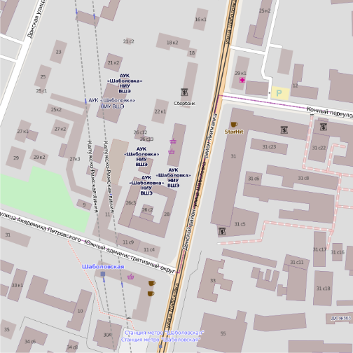
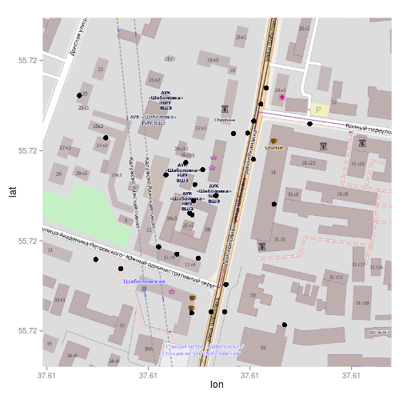

# Рисуем карты!

Карта вышки в три строчки!


```r
library(ggmap)
```

```
## Loading required package: ggplot2 Loading required package: methods
```

```r
hse.sha <- "shabolovka, 26"
qmap(location = hse.sha, zoom = 17, source = "osm")
```

```
## Map from URL :
## http://maps.googleapis.com/maps/api/staticmap?center=shabolovka,+26&zoom=17&size=%20640x640&maptype=terrain&sensor=false
## Google Maps API Terms of Service : http://developers.google.com/maps/terms
## Information from URL :
## http://maps.googleapis.com/maps/api/geocode/json?address=shabolovka,+26&sensor=false
## Google Maps API Terms of Service : http://developers.google.com/maps/terms
```

 


Добавим на карту координаты фотографий на [panoramio.com](panoramio.com)

Получаем данные:

```r
library(RCurl)
```

```
## Loading required package: bitops
```

```r
library(rjson)
library(plyr)

url <- "http://www.panoramio.com/map/get_panoramas.php?set=public&from=0&to=100&minx=37.606&miny=55.719&maxx=37.612&maxy=55.722"
panor.text <- getURL(url)

# this function creates an ugly list
panor.list <- fromJSON(panor.text)

# we just need the list of list called panor.list$photos the list of list as
# member of list... @#$%^!

# convert it to a pretty data frame!
panor <- ldply(panor.list$photos, data.frame)
head(panor)
```

```
##   height latitude longitude owner_id         owner_name
## 1    500    55.72     37.61  2316998 Merkushev Vladimir
## 2    375    55.72     37.61  4208432               murr
## 3    373    55.72     37.61  4143926            SHtOlG@
## 4    500    55.72     37.61  2316998 Merkushev Vladimir
## 5    332    55.72     37.61  2316998 Merkushev Vladimir
## 6    500    55.72     37.61  2316998 Merkushev Vladimir
##                               owner_url
## 1 http://www.panoramio.com/user/2316998
## 2 http://www.panoramio.com/user/4208432
## 3 http://www.panoramio.com/user/4143926
## 4 http://www.panoramio.com/user/2316998
## 5 http://www.panoramio.com/user/2316998
## 6 http://www.panoramio.com/user/2316998
##                                                  photo_file_url photo_id
## 1 http://mw2.google.com/mw-panoramio/photos/medium/68702622.jpg 68702622
## 2 http://mw2.google.com/mw-panoramio/photos/medium/72170944.jpg 72170944
## 3 http://mw2.google.com/mw-panoramio/photos/medium/58241646.jpg 58241646
## 4 http://mw2.google.com/mw-panoramio/photos/medium/68702599.jpg 68702599
## 5 http://mw2.google.com/mw-panoramio/photos/medium/68702614.jpg 68702614
## 6 http://mw2.google.com/mw-panoramio/photos/medium/68702607.jpg 68702607
##                                                                      photo_title
## 1 РЕЗЕРВНОЕ ПИТАНИЕ.. ..РЕЗЕРВНОЕ ПИТАНИЕ... Повсюду контра! маузер... маузер...
## 2                       храм ризоположения  на донской .1716. московское барокко
## 3                                                                         Москва
## 4                                                                               
## 5                                                                               
## 6                                                                               
##                                 photo_url    upload_date width
## 1 http://www.panoramio.com/photo/68702622  18 March 2012   320
## 2 http://www.panoramio.com/photo/72170944    16 May 2012   500
## 3 http://www.panoramio.com/photo/58241646 31 August 2011   500
## 4 http://www.panoramio.com/photo/68702599  18 March 2012   332
## 5 http://www.panoramio.com/photo/68702614  18 March 2012   500
## 6 http://www.panoramio.com/photo/68702607  18 March 2012   332
```


Нанесём точки на карту!

```r
# get the map
hse.map <- get_map(hse.sha, zoom = 17, source = "osm")
```

```
## Map from URL :
## http://maps.googleapis.com/maps/api/staticmap?center=shabolovka,+26&zoom=17&size=%20640x640&maptype=terrain&sensor=false
## Google Maps API Terms of Service : http://developers.google.com/maps/terms
## Information from URL :
## http://maps.googleapis.com/maps/api/geocode/json?address=shabolovka,+26&sensor=false
## Google Maps API Terms of Service : http://developers.google.com/maps/terms
```

```r

ggmap(hse.map) + geom_point(data = panor, aes(x = longitude, y = latitude), 
    size = 3)
```

 

