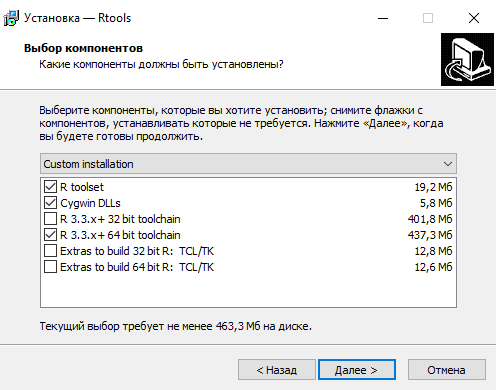
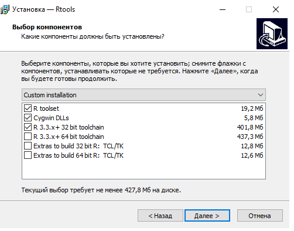
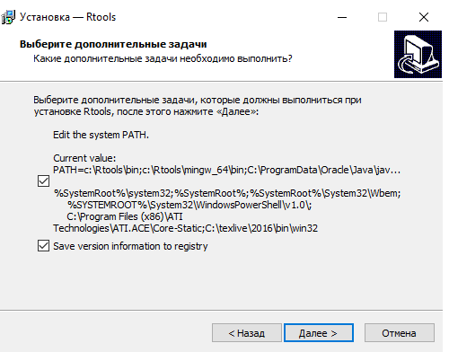
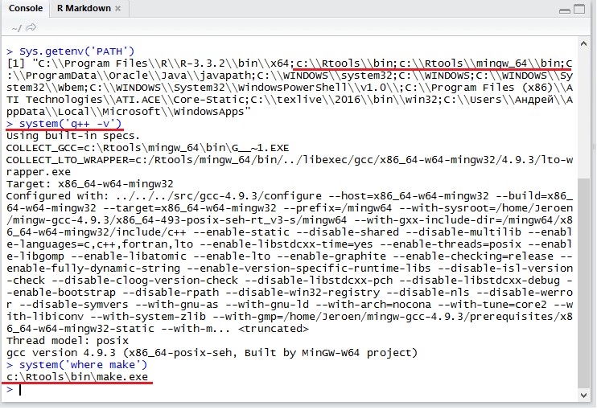

__RStan__ -- это реализация языка программирования __Stan__, используемого для построения статистических моделей на основе байесовского подхода, в __R__. Подробнее обо всех этих страшных словах можно почитать [здесь](https://en.wikipedia.org/wiki/Bayesian_inference), [здесь](https://en.wikipedia.org/wiki/Bayesian_programming) и [здесь](http://mc-stan.org/) (осторожно, возможен английский).

При составлении данной инструкции использовались материалы англоязычной инструкции по установке с сайта проекта [__mc-stan.org__](https://github.com/stan-dev/rstan/wiki/RStan-Getting-Started), а также материалы семинаров Б. Б. Демешева по эконометрике.

# Как установить RStan

## Если у Вас Windows

Есть мнение, что проприетарные системы (читай -- Windows и Mac OS) вредят открытости научного знания и разобщают исследователей, однако если они установлены на большинстве компьютеров в мире, то с ними придётся считаться. Данный раздел посвящён процессу установки среды RStan на компьютер с ОС Windows (начиная с Windows 7; более старые версии могут поддерживаться, но работа на них не гарантируется).

### Требования:

1. Сам __R__. Если у Вас его нет, то ~~что вы тут делаете? :)~~ идите и качайте последнюю версию с <https://www.r-project.org>.

2. __RStudio__ -- предполагается, что он у вас тоже уже есть; в противном случае [качаем](https://www.rstudio.com/products/rstudio/download/) (хотя его наличие/отсутствие не критично).

3. Набор инструментов __Rtools__. Этот набор содержит компилятор C++, необходимый для создания исполняемого файла на основе модели на языке Stan (и не только для этого).

  + Скачиваем набор отсюда: <https://cran.r-project.org/bin/windows/Rtools/>. Нужно выбрать наиболее свежую версию, поддерживающую Вашу версию R (например, _Rtools34.exe_, если у Вас R 3.3.0 и выше).

  + Устанавливаем. Как уже было сказано, Rtools предназначен не только для работы со Stan, поэтому установочный комплект содержит массу всего нужного и не совсем нужного. Дабы не захлямлять свой жёсткий диск лишними гига(?)байтами, рекомендую ставить следующие параметры установки:
  
    
  
    
  
    На следующем этапе (в окне "Выберите дополнительные задачи") отметьте галочкой опцию _"Edit the system PATH"_ (нужно, чтобы впоследствии R "увидел" компилятор C++):
  
    
  
    Дальше ничего не меняем и ждем завершения процесса установки.
    
  + Проверяем правильность установки.
    
    Перезапускаем R/RStudio и вбиваем следующие команды:

````{r, eval = FALSE}
Sys.getenv('PATH')
system('g++ -v')
system('where make')
````
    
В итоге должно получиться следующее:
    

    
Если что-то идёт не так (например, появляются сообщения об ошибках и пр.) -- смело переустанавливайте Rtools.

### Установка RStan (наконец-то!)

1. Откройте/перезапустите R/RStudio.

2. Установите Rstan из репозитория CRAN, запустив эту команду __(в точности!)__:

````{r, eval= FALSE}
install.packages("rstan", repos = "https://cloud.r-project.org", dependencies = TRUE)
````

В случае облома попробуйте другой вариант:
  
````{r, eval= FALSE}
Sys.setenv(MAKEFLAGS = "-j4") # вместо 4 поставьте количество ядер Вашего процессора
install.packages("rstan", type = "source")
````

3. Снова перезапустите R/RStudio.

4. Наконец, проверьте правильность установки RStan, запустив ещё одну команду:

````{r, eval= FALSE}
fx <- inline::cxxfunction( signature(x = "integer", y = "numeric" ) , '
    return ScalarReal( INTEGER(x)[0] * REAL(y)[0] ) ;
' )
fx( 2L, 5 ) # должно получиться 10
````

Готово!

## Если у Вас Mac OS или Linux

Данный раздел посвящён процессу установки среды RStan на компьютеры от Apple, а также на истинно свободные компьютеры с истинно свободной ОС Linux :)

## MacOS

Огромное спасибо Никите Герману за предоставленный MacBook :)

### Требования:

1. __R__.

2. __RStudio__ (наличие/отсутствие не критично).

3. Набор инструментов __Xcode__. Этот набор для Mac OS содержит компилятор C++, необходимый для создания исполняемого файла на основе модели на языке Stan. Установить его можно следующим образом:

  + Сначала нужно проверить используемую версию Mac OS. Для этого нужно нажать на логотип Apple в левом верхнем углу и в выпадающем меню выбрать пункт "Об этом Mac" ("About this Mac").
  
  
  
  + Через Spotlight проверяем, установлен ли Xcode на Вашем Mac:
  
    - Нажимаем клавишу __control__ и пробел.
    
    - В появившуюся строку вбиваем __Xcode__.
    
  Если появляется что-то подобное изображённому на картинке ниже, то эта программа у Вас есть и Вам нужно просто её обновить через App Store. Если же нет -- переходим к следующему шагу.
  
  
  
  + __Для OS X 10.8 "Mountain Lion" и выше:__
    
    - Откройте __App Store__ и найдите через поиск программу __Xcode__.
    
    - Выберите программу и выполните все шаги по её установке (можно оставить все параметры по умолчанию).
    
    - Запустите Xcode и примите лицензионное соглашение.
    
  + __Для OS X 10.7 "Lion" или Mac OS X 10.6 "Snow Leopard"__
  
    Этот раздел перекочевал сюда из [оригинальной инструкции](https://github.com/stan-dev/rstan/wiki/RStan-Mac-OS-X-Prerequisite-Installation-Instructions#step-2--install-c-toolchain).
  
    - [Зарегистрируйтесь на сайте для разработчиков](https://developer.apple.com/register), если Вы ещё не сделали этого.
    
    - Перейдите на сайт [Downloads Page for Developers](https://developer.apple.com/downloads); если нужно -- войдите с помощью Apple ID.
    
    - Скачайте и установите наиболее свежую версию Xcode.
    
    - Откройте R/RStudio и наберите команду:
    
````{r, eval = FALSE}
system('clang++ -v')
````
  
Если компилятор C++ установлен, то появится номер версии; если же нет, то вернитесь на страницу [Downloads Page for Developers](https://developer.apple.com/downloads) и скачайте последнюю версию __Command Line Tools__.

  + Переходите к установке __RStan__.

### Установка RStan

1. Откройте/перезапустите R/RStudio.

2. Установите Rstan из репозитория CRAN, запустив эту команду __(в точности!)__:

````{r, eval= FALSE}
install.packages("rstan", repos = "https://cloud.r-project.org", dependencies = TRUE)
````

  В случае облома попробуйте другой вариант:
  
````{r, eval= FALSE}
install.packages("rstan", type = "source")
````

3. Снова перезапустите R/RStudio.

4. Наконец, проверьте правильность установки RStan, запустив ещё одну команду:

````{r, eval= FALSE}
fx <- inline::cxxfunction( signature(x = "integer", y = "numeric" ) , '
    return ScalarReal( INTEGER(x)[0] * REAL(y)[0] ) ;
' )
fx( 2L, 5 ) # должно получиться 10
````

Готово!

## Linux

Эх, всё через одно место -- консоль... или менеджер пакетов.

### Требования:

1. __R__.

2. __RStudio__ (наличие/отсутствие не критично).

3. С помощью менеджера пакетов ставим __build-essential__, __libssl-dev (строго до версии 1.0)__, а также свежую версию __g++__ или __clang++__ (на выбор).

### Установка RStan

1. Откройте/перезапустите R/RStudio.

2. В R/RStudio задайте количество ядер процессора, которое Вы хотите выделить для программы:

````{r, eval= FALSE}
Sys.setenv(MAKEFLAGS = "-j4") ## поставьте нужное количество вместо 4
````

3. Установите Rstan из репозитория CRAN, запустив эту команду __(в точности!)__:

````{r, eval= FALSE}
install.packages("rstan", repos = "https://cloud.r-project.org", dependencies = TRUE)
````

  В случае облома попробуйте другой вариант:
  
````{r, eval= FALSE}
install.packages("rstan", type = "source")
````

4. Снова перезапустите R/RStudio.

5. Наконец, проверьте правильность установки RStan, запустив ещё одну команду:

````{r, eval= FALSE}
fx <- inline::cxxfunction( signature(x = "integer", y = "numeric" ) , '
    return ScalarReal( INTEGER(x)[0] * REAL(y)[0] ) ;
' )
fx( 2L, 5 ) # должно получиться 10
````

Готово!

# Как пользоваться RStan

1. Запускаем R/RStudio.

2. Необходимый пакет называется __rstan__. Подгружаем его с помощью следующей команды:

````{r, eval= FALSE}
library('rstan')
````

Появляющееся после выполнения команды сообщение предлагает установить режим параллельных вычислений для ускорения процесса (рекомендуется для компьютеров с многоядерными процессорами и большим объёмом оперативной памяти (от 6 Гбайт)). Эти команды также активируют режим записи скомпилированных программ на жёсткий диск (полезно, если не хотите каждый раз компилировать программу заново для разных данных в одной модели).

````{r, eval= FALSE}
rstan_options(auto_write = TRUE)
options(mc.cores = parallel::detectCores())
````

В дальнейшем можете прописывать эти команды непосредственно в файле скрипта R, с помощью которого выполняется анализ данных.

3. Создаём текстовый файл и сохраняем его с расширением __.stan__, затем создаём стандартный скрипт R.

  Структура файла __.stan__ включает в себя несколько основных блоков:
  
  - __data{*содержимое*}__ -- определяет внешние данные, которые мы "скармливаем" модели;
  
  - __parameters{*содержимое*}__ -- параметры модели (случайные величины), подчиняющиеся некоему заранее определённому (априорному) распределению;
  
  - __model{*содержимое*}__ -- сама модель;
  
  - __generated quantities{*содержимое*}__ -- блок для построения прогнозных значений.
  
  В файле __.R__ должны содержаться команды для компиляции программы, передачи ей данных и анализа полученных результатов.
  
  Для примера решим в STAN задачу Сэра Томаса Байеса. 
  
  Монетку с неизвестной вероятностью выпадения орла $p$ подбросили три раза. И все три раза она выпала орлом. Какова вероятность того, что она выпадет орлом в следующий раз? Какова вероятность того, что $p$ больше половины с учётом имеющихся наблюдений?
  
Модель для данных проста:

\[
y_n|p \sim Bernoulli(p)
\]

Априорное мнение о $p$ возьмём равномерное на $[0;1]$:

\[
p \sim Uniform[0;1]
\]
  
  
Создаём файл `bayes_coins.stan`:

```{r, eval=FALSE}
data {
  int N; // число наблюдений
  int y[N]; // отдельные наблюдения
}
parameters {
  real<lower=0, upper=1> p; // вероятность орла
}
model {
  // априорно:
  p ~ uniform(0, 1);
  // модель: как наблюдения связаны с параметром
  for (n in 1:N) {
    y[n] ~ bernoulli(p);
  }
}
generated quantities {
  int y_new; // результат следующего броска
  y_new = bernoulli_rng(p); // генерация будущего игрека
}
```

Благородные доны и доньи не забывают перенос строки в последней строке :)

И теперь из R сделаем всё нужное:
```{r, message=FALSE, warning=FALSE}
library(rstan)
library(bayesplot)

model <- stan_model(file = "coins.stan")
df <- list(N = 2, y = c(1, 1))
fit <- sampling(model, data = df)

fit

fit_array <- as.array(fit)
mcmc_hist(fit_array)
```

4. Программируем!

...что значит "как"?

Полный список всех возможных команд для языка __Stan__ ищите на [mc-stan.org](http://mc-stan.org/documentation/) :)